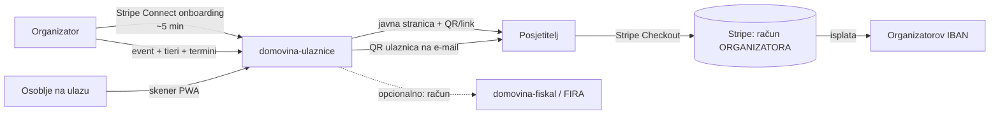
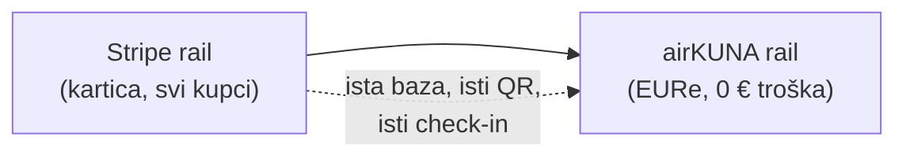

# 01 — Vizija i poslovni model

> Datum: 2026-08-03 · Jezik: HR
> Kontekst: `safe-wallet-monorepo/docs/whitelabel-wallet/11-dogadjaji-p2p-ticketing.md`
> (izvorna teza, P2P varijanta), `rodjendaonice.domovina.ai/docs/marketplace/porezni-model.md`
> (naučeno o marketplace naplati).

## 1. Teza

Organizator događaja u Hrvatskoj danas ima tri loše opcije:

1. **Posrednik** (Entrio, Eventbrite, TicketTailor) — booking fee posjetitelju
   2,7–5,5 %, posrednik drži novac do isplate i posjeduje odnos s kupcem.
2. **Stripe Payment Link / uplata na IBAN + Google Forms** — bez ulaznice, bez
   inventoryja, bez check-ina; ručno sparivanje uplata u tablici.
3. **Ništa** — prodaja na ulazu, gotovina.

`domovina-ulaznice` je četvrta opcija: **vlastita prodajna stranica s pravim
ulaznicama, gdje novac ide izravno organizatoru, a platforma ne uzima ništa s
ulaznice**. Tehnički: Stripe Connect direct charge s `application_fee_amount = 0`.

Opcija 2 nije hipoteza — to je **stvarni tok koji danas održavamo**:
`fira-forms-connector` (Google Forms → Google Sheets → ručni upis iznosa u stupac
`Uplata` → klik checkboxa → FIRA račun) opslužuje pet događaja Katoličke udruge
"Prilika za Susret" u 2026. Taj repo je najbolji mogući dokaz problema i ujedno
prvi design partner.

## 2. Tko su prvi korisnici

| #   | Segment                                                   | Dokaz iz vlastitih podataka                                              | Što danas koriste                          |
| --- | --------------------------------------------------------- | ------------------------------------------------------------------------ | ------------------------------------------- |
| 1   | **Katoličke udruge / duhovni susreti**                    | `fira-forms-connector`: Badija, Osijek, Šibenik, Ćunski, Sinj (2026)     | Google Forms + IBAN + ručni FIRA račun      |
| 2   | **Konferencije**                                          | Money Motion 2027, BlockSplit (Luka Sučić, zahtjev 2026-07-16)           | Entrio (4,00 € / 2,72 € fee po ulaznici)    |
| 3   | **Humanitarni koncerti / udruge**                         | `hrvatskazazivot-novcanik-zivot-prototip` (Sisak, Thompson)              | Entrio                                       |
| 4   | **Manji organizatori edukacija**                          | EHO konferencija: TicketTailor + Stripe Payment Link + Forms + IBAN      | tri paralelna kanala, ručno sparivanje      |

Segment 1 je najbrži put do prvog pravog prometa: postoji povjerenje, poznat je
tok, cijene su male (50–120 €), a bol (ručno sparivanje uplata i računa) je akutna.

## 3. Što proizvod radi

MVP obećanje organizatoru, u jednoj rečenici: *"Napravi event u 10 minuta, podijeli
link, novac ti sjeda na tvoj Stripe račun bez naše provizije, a na ulazu skeniraš
QR."*

## 4. Zašto 0 %

Nije altruizam nego pozicioniranje i pojednostavljenje:

1. **Diferencijacija je mjerljiva.** "0 € naknade" naspram "4 € po ulaznici" je
   argument koji organizator razumije u sekundi.
2. **Pravno je jednostavnije.** Čim platforma uzima proviziju iz uplate, otvara se
   pitanje je li ona prodavatelj i mora li fiskalizirati puni iznos — točno pitanje
   koje je u `rodjendaonice/docs/marketplace/porezni-model.md` §1.1 označeno kao
   ⚠️ ODLUKA koja **blokira live ključeve**. S 0 % i direct chargeom to pitanje
   nestaje: platforma nije u lancu isporuke ni u toku novca.
3. **Monetizacija ide drugdje** (§5) — ulaznica ostaje besplatan kanal.

## 5. Monetizacija (post-MVP, svjesno odgođena)

| Model                                        | Kada                         | Napomena                                                                 |
| -------------------------------------------- | ---------------------------- | ------------------------------------------------------------------------ |
| **Pretplata organizatora** (npr. 19 €/mj)    | nakon 3–5 aktivnih događaja  | ne dira tok novca s ulaznice → porezno trivijalno                        |
| **Fiskalizacija kao usluga**                  | uz U5                        | naplaćuje se izdavanje računa, ne prodaja ulaznice; dijeli `domovina-fiskal` |
| **Napredne značajke** (seating, akreditacije) | kasnije                      | klasični SaaS add-oni                                                    |
| ~~Provizija s ulaznice~~                     | **nikad u ovom proizvodu**   | to je posao od kojeg bježimo                                             |

Do tada je proizvod besplatan i to je namjerno: prvi cilj je dokazan promet i
referentni organizatori, ne prihod.

## 6. Odnos prema P2P/wallet varijanti

Doc 11 iz `safe-wallet-monorepo` opisuje istu tezu s **EURe na Gnosisu** i
plaćanjem iz self-custody walleta. Ta varijanta je isporučena (E1–E4) i živi, ali
ima dvije prepreke za mainstream organizatora: kupac mora imati wallet i EURe, a
organizator mora rješavati off-ramp (KYB, Monerium).

Zato je redoslijed obrnut od izvornog plana:

Isti event, isti tieri, iste ulaznice — samo drugi način plaćanja. Zbog toga
ticketing jezgra ostaje u `domovina-api` (v. [02](02-arhitektura.md) §2), gdje
onchain rail već radi.

## 7. Što NIJE u opsegu

- Sekundarno tržište / preprodaja ulaznica (anti-scalping model postoji u
  `mpt-novcanik-wallet` prototipu — post-MVP).
- Seating (numerirana mjesta), akreditacijski sustavi, badge print.
- Marketing alati (newsletter, affiliate, promo kodovi) — osim osnovnog popusta.
- Vlastita obrada kartica: Stripe je jedini rail u U1–U5.
