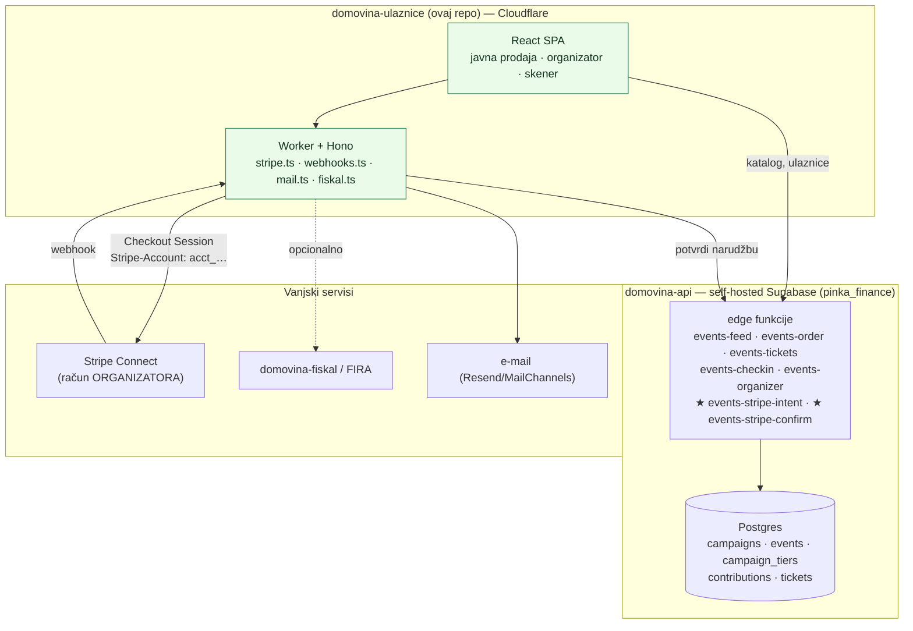
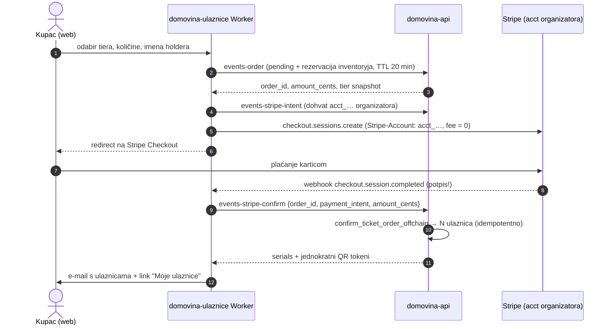

# 02 — Arhitektura

> Datum: 2026-08-03 · Odluka potvrđena 2026-08-03: **reuse `domovina-api` jezgre**.
> Izvori: `domovina-api/supabase/migrations/20260716*`, `20260717*`,
> `domovina-api/docs/events-ticketing-curl-scenario.md`,
> `rodjendaonice.domovina.ai/apps/marketplace/worker/*`.

## 1. Granice odgovornosti



**Pravilo koje sve drži na okupu:** `domovina-api` je jedini izvor istine o
događajima i ulaznicama. Ovaj repo ne drži vlastitu kopiju ulaznica — ni u D1, ni
u KV-u. Ako se ikad pojavi potreba za lokalnom tablicom ulaznica, to je signal da
je granica prekršena.

Što ovaj repo **jest**: prodajni kanal (web), Stripe rail i sve što Stripe traži
(webhook potpis, idempotencija, rekoncilijacija, refund), dostava ulaznica
e-mailom i tenant-config koji nema smisla u ticketing jezgri (Stripe account id,
postavke računa, brand stranice).

## 2. Zašto reuse, a ne novi backend

`pinka_finance` pokriva ticketing gotovo u cijelosti i to je **deployano i
testirano** (E2–E4, 2026-07-17):

| Potreba                             | Postoji                                                                     |
| ----------------------------------- | --------------------------------------------------------------------------- |
| Event s terminom, venueom, opisom   | `pinka_finance.events` (1:1 uz `campaigns` `type='tickets'`)                |
| Tieri s cijenom i inventoryjem      | `campaign_tiers` (`price_cents`, `inventory_total/claimed`)                 |
| Imenske ulaznice, prodajni prozor   | `campaign_tiers.imenska`, `sale_start`, `sale_end`                          |
| Narudžba s rezervacijom i TTL-om    | `contributions` (`quantity`, `holders`, `reserved`, `reserve_expires_at`)   |
| Oversell zaštita, idempotencija     | `create_ticket_order` RPC + `expire_stale_ticket_orders`                     |
| Ulaznica-komad, QR, check-in        | `tickets` + `redeem_ticket` / `void_ticket`                                 |
| Organizator self-service, moderacija| `update_event`, `publish_event`, `organizer_allowlist`, `organizer_overview` |
| Multi-tenant + role                 | `public.accounts` + `accounts_memberships` + RLS                            |

Duplicirati to u D1 značilo bi ponovno pisati oversell logiku, TTL rezervacije,
QR-hash model i RLS — i imati **dva izvora istine o istoj ulaznici** čim airKUNA
rail proradi. Lekcija je već zapisana u `13-lekcije-sesije-dogadjaji.md` §3:
*"Prije gradnje backenda — pročitaj što već postoji."*

## 3. Što je novo (i samo to)

### 3.1 U `domovina-api`

Dvije edge funkcije + jedna migracija (detalji: [05](05-podatkovni-model.md)):

| Novo                                  | Uloga                                                                                          |
| ------------------------------------- | ---------------------------------------------------------------------------------------------- |
| `events-stripe-intent`                | primi `order_id` postojeće `pending` narudžbe → vrati podatke potrebne za Checkout (iznos, tier, organizatorov `stripe_account_id`) |
| `events-stripe-confirm`               | pozvana **isključivo iz našeg Workera nakon verifikacije webhook potpisa**; kreditira narudžbu i izdaje ulaznice |
| `confirm_ticket_order_offchain()` RPC | analogon `confirm_ticket_order`, ali s `rail='stripe'` i `external_ref = payment_intent`         |
| `organizer_payment_rails` tablica     | po org accountu: `stripe_account_id`, `charges_enabled`, `payouts_enabled`, `invoice_provider`   |

Postojeći onchain put ostaje netaknut — `events-confirm` se ne dira.

### 3.2 U ovom repou

```
worker/
  index.ts        Hono router, CORS, rate limit
  stripe.ts       Connect onboarding link, Checkout session (direct charge), refund
  webhooks.ts     verifikacija potpisa → events-stripe-confirm → e-mail
  reconcile.ts    cron: nesparene uplate, istekli holdovi, retry confirm
  api.ts          tanki klijent prema domovina-api edge funkcijama
  mail.ts         dostava ulaznica (PDF/QR) i podsjetnika
  fiskal.ts       InvoiceProvider: domovina-fiskal | fira | organizator-sam
src/
  pages/public/   event landing, checkout, "moje ulaznice" (po tokenu iz maila)
  pages/organizer/ onboarding, event editor, prodaja, isplate
  pages/scan/     check-in PWA
```

## 4. Tok kupnje (Stripe rail)



Rubni slučajevi koje tok mora izdržati (svi imaju presedan u
`rodjendaonice/apps/marketplace/worker/`):

| Slučaj                                     | Rješenje                                                                                     |
| ------------------------------------------ | -------------------------------------------------------------------------------------------- |
| Kupac zatvori tab nakon plaćanja           | webhook je izvor istine, ne redirect                                                          |
| Webhook stigne dvaput                      | idempotencija na `(rail, external_ref)` unique indexu u bazi, ne u kodu                       |
| Rezervacija istekne prije plaćanja         | `confirm_ticket_order_offchain` pokuša re-rezervirati; ako je tier pun → `expired_sold_out` → **automatski refund** |
| Checkout session istekne (min. 30 min)     | isti obrazac kao `rodjendaonice`: hold TTL ≠ session TTL, rekoncilijacija čisti               |
| Uplata bez narudžbe / narudžba bez uplate  | cron `reconcile.ts` → red za ručno sparivanje                                                 |
| Refund                                     | `refunds.create` na acct organizatora + `void_ticket` na svaku ulaznicu                       |

## 5. Autentikacija i pristup

| Akter        | Kako se autentificira                                                                    |
| ------------ | ----------------------------------------------------------------------------------------- |
| Kupac        | **bez računa** — `order_id` (UUID) je bearer capability; "Moje ulaznice" preko potpisanog linka iz e-maila. Presedan: `contribution_status` i E2 zapisnik. |
| Organizator  | GoTrue (isti Domovina identitet kao `domovina-fiskal-app` i `pinka.io`) → JWT → RLS po `accounts_memberships`. **Ovdje se rješava dug iz E4** (zalijepljeni token). |
| Osoblje ulaza| org admin JWT; svaki sken se autorizira server-side (`redeem_ticket` provjerava rolu)      |
| Worker→API   | service-role ključ, samo iz Workera, nikad iz SPA                                          |

## 6. Deploy

| Komponenta          | Kako                                                                                  |
| ------------------- | -------------------------------------------------------------------------------------- |
| Worker + SPA        | `npx wrangler deploy` / `wrangler pages deploy` (Cloudflare račun D.O.M.)              |
| Migracije + funkcije| `domovina-api/scripts/db-migrate.sh --dry-run` → `db-migrate.sh` → `deploy-functions.sh --only=<fn>` (SSH preduvjet) |
| Tajne               | `wrangler secret put STRIPE_SECRET_KEY / STRIPE_WEBHOOK_SECRET / DOMOVINA_API_SERVICE_KEY` |

Migracije su idempotentne (drugi run = no-op) — konvencija iz `domovina-api`.

## 7. Prilika za Susret kao prvi tenant

Konkretna migracija s današnjeg toka (`fira-forms-connector`):

| Danas                                   | S ovim proizvodom                                   |
| --------------------------------------- | ---------------------------------------------------- |
| Google Forms prijava                    | prodajna stranica eventa s tierima                   |
| Ručni upis iznosa u stupac `Uplata`     | Stripe Checkout, iznos je tier                       |
| Uplata na IBAN + ručno sparivanje       | automatski (webhook)                                 |
| Klik checkboxa → FIRA račun (GAS)       | `InvoiceProvider = fira` (isti API, ista udruga)     |
| Cjenovni razredi po datumu (50/55/60 €) | `sale_start` / `sale_end` po tieru                   |
| Popis sudionika u Sheetu                | `holders` + izvoz iz organizator dashboarda          |
| Nema kontrole ulaza                     | QR check-in                                          |

Zbog toga U5 (računi) ima **FIRA adapter**, a ne samo `domovina-fiskal`: postojeći
korisnici već imaju FIRA račun i ne moraju ništa mijenjati.
