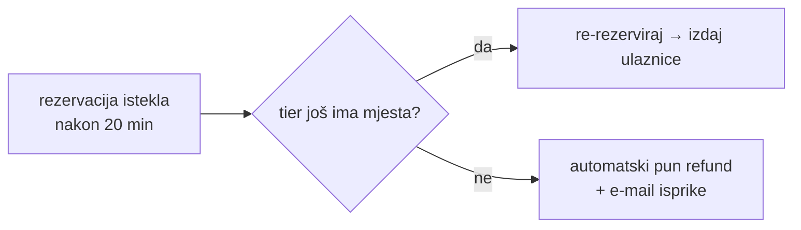

# 03 — Stripe Connect uz 0 % naknade

> Datum: 2026-08-03 · Odluka: **direct charges, `application_fee_amount` se ne šalje.**
> Presedan u kodu: `rodjendaonice.domovina.ai/apps/marketplace/worker/stripe.ts`,
> `webhooks.ts`, `refunds.ts`, `reconcile.ts`.
> ⚠️ Prije prvog live ključa pročitati `rodjendaonice/docs/marketplace/porezni-model.md` §1.1.

## 1. Tri modela naplate i zašto biramo treći

| Model                                          | Tko je settlement merchant | Novac prolazi kroz platformu | Tko fiskalizira puni iznos |
| ---------------------------------------------- | -------------------------- | ---------------------------- | -------------------------- |
| Destination charge (bez `on_behalf_of`)        | **platforma**              | da                           | rizik: platforma           |
| Destination charge + `on_behalf_of`            | organizator                | da (pa transfer)             | organizator                |
| **Direct charge (`Stripe-Account` header)**    | **organizator**            | **ne**                       | organizator                |

`rodjendaonice` koristi prvi model jer uzima proviziju i tamo je to otvoreno
porezno pitanje koje blokira produkciju (`porezni-model.md` §1.1: *"Do te odluke
ne palimo live ključeve."*).

**Kod nas provizije nema, pa nema ni razloga za tu komplikaciju.** Direct charge:

- naplata nastaje **na Stripe računu organizatora**; sredstva nikad ne dodiruju
  balance platforme,
- Stripeovu procesorsku naknadu plaća organizator (kao da je sam integrirao Stripe),
- povrat, chargeback i isplata su odnos organizator ↔ Stripe,
- platforma je tehnički posrednik: pruža softver, ne uslugu ulaska na događaj.

To je najjasnija moguća pozicija za sva pitanja iz [04](04-porezni-i-pravni-okvir.md).

## 2. Onboarding organizatora

Obrazac se kopira iz `rodjendaonice/worker/stripe.ts::onboardingLink()` uz dvije
izmjene: `mcc` i `business_profile`.

```ts
const acct = await stripe.accounts.create({
  type: "express",
  country: "HR",
  email: organizer.email ?? undefined,
  business_profile: {
    name: organizer.legal_name,
    url: organizer.web ?? undefined,
    mcc: "7922",                     // kazališta/predstave/ulaznice (provjeriti u Stripe MCC popisu)
  },
  capabilities: { card_payments: { requested: true }, transfers: { requested: true } },
});
const link = await stripe.accountLinks.create({
  account: acct.id,
  type: "account_onboarding",
  refresh_url: `${base}/organizator/postavke?stripe=refresh`,
  return_url:  `${base}/organizator/postavke?stripe=return`,
});
```

Invarijant preuzet iz `rodjendaonice/worker/bookable.ts`: **event bez
`stripe_account_id` i bez `charges_enabled` je vidljiv, ali se ne može kupiti.**
Nikad ne kreirati Checkout session "u prazno". Sirovi `acct_…` id se **nikad** ne
šalje klijentu — javno ide samo izvedeni boolean (`stripe_connected`).

## 3. Checkout session (direct charge)

```ts
const session = await stripe.checkout.sessions.create(
  {
    mode: "payment",
    // TTL: Stripe dopušta najranije +30 min. Naša rezervacija je 20 min →
    // između 20. i 30. minute plaćanje može stići na isteklu rezervaciju.
    // To NIJE bug nego poznati prozor: confirm pokuša re-rezervirati, a ako
    // je tier u međuvremenu rasprodan → automatski refund (§5).
    expires_at: Math.floor(Date.now() / 1000) + 30 * 60,
    customer_email: buyerEmail,
    line_items: [{
      quantity: order.quantity,
      price_data: {
        currency: "eur",
        unit_amount: tier.price_cents,
        product_data: { name: `${tier.title} — ${event.title}`, description: eventWhen },
      },
    }],
    payment_intent_data: {
      // ⚠️ application_fee_amount se NE šalje — 0 % je proizvodna odluka, ne konfiguracija.
      metadata: { order_id: order.id, campaign_id: order.campaign_id },
    },
    metadata: { order_id: order.id },
    success_url: `${base}/ulaznice/${order.id}?placeno=1`,
    cancel_url:  `${base}/dogadjaj/${event.slug}?otkazano=1`,
  },
  { stripeAccount: organizer.stripe_account_id },   // ← direct charge
);
```

`capture_method` ostaje `automatic`: kod ulaznica nema "potvrde organizatora" kao
kod rezervacije termina, pa manual capture nema svrhu.

## 4. Webhook

Webhook se prima **po connected accountu** (Connect webhook endpoint), pa svaki
event nosi `account: "acct_…"`.

| Stripe event                     | Akcija                                                                     |
| -------------------------------- | --------------------------------------------------------------------------- |
| `checkout.session.completed`     | `events-stripe-confirm` → izdaj ulaznice → e-mail                           |
| `charge.refunded`                | `void_ticket` za sve ulaznice narudžbe + narudžba `refunded`                |
| `account.updated`                | osvježi `charges_enabled` / `payouts_enabled` u `organizer_payment_rails`   |
| `payment_intent.payment_failed`  | log; rezervacija istječe sama                                                |
| `charge.dispute.created`         | zabilježi + obavijesti organizatora (ulaznicu ne poništavaj automatski)     |

Tri pravila, sva izvučena iz presedana:

1. **Potpis se verificira prije ičega** (`stripe.webhooks.constructEventAsync`);
   bez `STRIPE_WEBHOOK_SECRET` funkcija vraća 503, ne prolazi dalje.
2. **Webhook je jedini izvor istine o plaćanju** — `success_url` redirect samo
   prikazuje stanje, nikad ne kreditira narudžbu.
3. **Idempotencija je u bazi**, ne u kodu: unique `(payment_rail, external_ref)`.
   Ponovljena dostava istog eventa vraća `already_paid`.

## 5. Rubni slučaj: plaćeno, a tier rasprodan

Jedini scenarij u kojem 0 %-model može ostaviti kupca bez ulaznice:



Refund ide `stripe.refunds.create({ payment_intent }, { stripeAccount })` — bez
`reverse_transfer` i `refund_application_fee` (nema transfera ni feeja; to su
parametri destination modela iz `rodjendaonice`). Rezultat mora biti zabilježen u
`contribution_events` da postoji trag.

## 6. Rekoncilijacija (cron)

Preuzeti obrazac iz `rodjendaonice/worker/reconcile.ts`:

| Provjera                                                          | Reakcija                                   |
| ----------------------------------------------------------------- | ------------------------------------------- |
| `pending` narudžba starija od TTL-a s uspješnim PaymentIntentom   | pokreni confirm (propušten webhook)         |
| `paid` narudžba bez izdanih ulaznica                              | ponovi izdavanje (idempotentno)             |
| PaymentIntent bez `order_id` u metapodacima                       | red za ručno sparivanje + alarm             |
| Refund na Stripeu bez `refunded` u bazi                           | uskladi stanje + `void_ticket`              |

## 7. Testiranje bez pravog novca

- Stripe **test ključevi** + test connected account (Express onboarding u test modu).
- `stripe listen --forward-to localhost:8787/webhook/stripe` za lokalni razvoj.
- Test kartice: `4242…` (uspjeh), `4000 0000 0000 9995` (odbijena), `4000 0025 0000 3155` (3DS).
- Prihvatni scenarij U1/U2 (v. handoffi) mora proći **prije** nego se live ključ
  uopće zatraži.

## 8. Otvorena pitanja

1. **MCC kod** za prodaju ulaznica (7922 vs 7929) — potvrditi u Stripe dokumentaciji
   prije prvog onboardinga; utječe na rizik-profil računa.
2. **Stripe Connect u HR**: potvrditi da Express onboarding za hrvatske **udruge**
   (ne d.o.o./obrt) prolazi — segment 1 iz [01](01-vizija-i-model.md) su udruge.
3. **Tko plaća Stripeovu naknadu ako organizator želi cijenu "sve uključeno"** —
   opcija da se naknada dodaje kupcu je moguća, ali onda proizvod više nije
   "0 € naknade" u marketingu. Preporuka: ne raditi.
4. **Payout raspored** — Stripe zadano isplaćuje po rasporedu connected accounta;
   organizatoru to treba objasniti u onboardingu (nije instant kao EURe rail).
5. 🔴 **Express vs Standard — odluka iz ovog dokumenta je pod upitnikom.**
   Uz Express **platforma** nosi odgovornost za prijevaru i sporove i kod direct
   chargea, plus Express ima dodatni trošak. Na proizvodu s 0 % naknade to znači
   nula prihoda uz sav chargeback rizik. Kod Standarda odgovornost pada na
   **connected account** (organizatora), koji i jest prodavatelj — što se poklapa
   s [04](04-porezni-i-pravni-okvir.md). Stripe usto tipove računa smatra
   zastarjelima za nove platforme i upućuje na Accounts v2 / controller
   properties. Argumentacija i tablica:
   [2026-08-08 §7.1](2026-08-08-deploy-okruzenja-i-stripe.md#71-express-vs-standard--ovo-je-najveće).
   **Odlučiti prije prvog pravog organizatora.**
6. **Pravni subjekt platforme** — sandbox je pod `italk.hr`. Platforma je ugovorna
   strana prema Stripeu i njezin branding organizator vidi u onboardingu.
   Connected accounti se ne sele bez ponovnog onboardinga, pa odluka mora doći
   prije prvog onboardinga, ne poslije.
