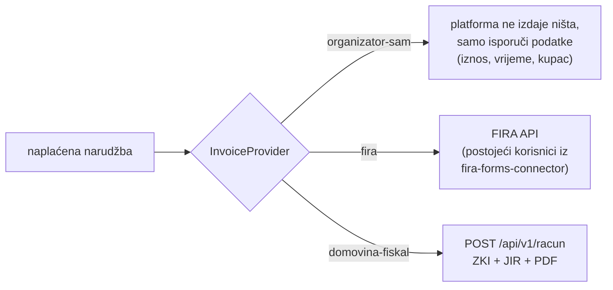

# 04 — Porezni i pravni okvir

> Datum: 2026-08-03 · **Nije pravni savjet.** Sve činjenice o fiskalizaciji
> preuzete su iz `domovina-fiskal/docs/knowledge/` (SPOT s izvorima i datumima) i
> iz `rodjendaonice.domovina.ai/docs/marketplace/porezni-model.md`. Ovdje se ne
> prepričavaju iz sjećanja nego citiraju s putanjom.
> Stavke koje traže knjigovođu/poreznog savjetnika označene su ⚠️ **ODLUKA**.

## 1. Zašto je ovo P0, a ne "kasnije"

Iz `domovina-fiskal/docs/knowledge/01-pravni-okvir.md` §2.2 (preko
`porezni-model.md` §0):

- Zakon o fiskalizaciji **NN 89/25** na snazi od 1. 9. 2025., **primjena od
  1. 1. 2026.** — dakle obveza je danas (2026-08-03) već aktivna.
- **Okidač je način naplate, ne status kupca**: gotovina, kartice i digitalni
  servisi plaćanja tretiraju se jednako.

**Posljedica za nas:** svaka kartična prodaja ulaznice krajnjem kupcu traži
**fiskalizirani račun s JIR-om i ZKI-jem**. Obveznik je **organizator** (on prodaje
uslugu ulaska), ne platforma — to je i razlog zašto je direct charge iz
[03](03-stripe-connect-0-posto.md) jedini model koji tu tvrdnju drži.

## 2. Tko što izdaje

| # | Dokument                    | Izdavatelj      | Primatelj      | Tip                                    | Kada             |
| - | --------------------------- | --------------- | -------------- | -------------------------------------- | ---------------- |
| 1 | Račun za ulaznicu           | **organizator** | kupac (fizička)| `FISKALNI_B2C`, `nacinPlacanja: KARTICA` | na uspješnu naplatu |
| 2 | Račun za pretplatu na SaaS  | platforma       | organizator    | `ERAČUN_B2B`                           | mjesečno, tek s monetizacijom |

Dokument 2 ne postoji u MVP-u jer je proizvod besplatan. Dokument 1 je jedini koji
gradimo — i to **iza sučelja**, jer organizatori nisu isti:

**MVP pušta samo `organizator-sam` i `domovina-fiskal` u TEST okolini** (odluka
2026-08-03). Razlog: ⚠️ ODLUKE u §6 nisu odgovorene, a `rodjendaonice/worker/fiskal.ts`
već ima ugrađenu bravu — `provjeriOkolinu()` odbija svaki host koji nije test.
Isti mehanizam se prenosi ovdje.

## 3. Preduvjeti da organizator može fiskalizirati kroz nas

Iz `domovina-fiskal/docs/knowledge/04-certifikati-fina-akd.md` i
`05-podatkovni-model-multitenant.md`:

| Preduvjet                          | Napomena                                                          | Trošak                 |
| ---------------------------------- | ------------------------------------------------------------------ | ---------------------- |
| OIB organizatora                   | u ticketing shemi danas ne postoji → dodaje se uz DAC7 zapis        | —                      |
| Aplikacijski certifikat (FINA/AKD) | soft `.p12` na OIB pravne osobe, vrijedi 5 god.                     | ~49,78 € jednokratno   |
| **Zaseban poslovni prostor/NU**    | za internetsku prodaju, npr. `ONLINE1`                              | 0 €                    |
| OIB operatera                      | CIS element `OibOper`, obavezan za `FISKALNI_B2C`                   | 0 €                    |
| Tenant u `domovina-fiskal`         | certifikat enkriptiran (envelope, `ENC_MASTER_KEY`)                 | 0 €                    |
| Punomoć/ovlaštenje                 | pravni temelj da izdajemo račune u njegovo ime                      | — (uvjeti korištenja)  |

⚠️ **Kritično — brojevi računa se ne smiju sudarati.** `domovina-fiskal` broji po
`(tenant, vrsta, PP ili NU, godina)` (`backend/migrations/0002_dokumenti.sql`).
Ako organizator već izdaje račune na svojoj blagajni pod istim poslovnim
prostorom, a mi počnemo izdavati pod istim PP/NU, **slijednost puca** — klasična
fiskalizacijska greška. Pravilo: **svaki organizator dobiva zaseban PP ili barem
zaseban NU za online prodaju**, prijavljen Poreznoj.

## 4. PDV na ulaznice

- **Mjesto oporezivanja** za ulaz na priredbe = mjesto održavanja (RH).
  Organizator obračunava PDV u svojoj cijeni; platforma ne dira porezni tretman
  jer nije u lancu isporuke.
- **Organizatori izvan sustava PDV-a** (udruge ispod praga 100.000 €): na računu
  ide klauzula **čl. 90. st. 1. Zakona o PDV-u**. `domovina-fiskal` to već ima
  (`backend/src/validacija.ts`, `KLAUZULA_CL90`), a isti tekst danas stoji u
  `fira-forms-connector` konfiguracijama (`TERMS_HR`) — dakle obrazac je provjeren
  u praksi.
- ⚠️ **ODLUKA:** tretman **kotizacije koja uključuje smještaj/obroke** (npr. Ćunski
  kamp) — jedna usluga ili više stopa? Utječe na strukturu stavki računa.
- ⚠️ **ODLUKA:** strani kupci B2B ulaznica — reverse charge **ne vrijedi** za
  ulaznice; potvrditi tretman.

## 5. DAC7

Platforma koja posreduje prodaju osobnih usluga ima godišnju obvezu izvještavanja
o prodavateljima (doc 11 §6.3). Ulaznice vrlo vjerojatno ulaze u opseg.

Praktično: **evidencija organizatora (pravni subjekt, OIB, adresa, financijski
identifikator) je obavezan dio onboardinga**, ne opcija. RPC `upsert_organizer_record`
za to već postoji u `domovina-api` (`20260717130000_events_organizer.sql`) i podaci
su RLS-zaključani (service_role + org admin), nikad u javnom feedu.

⚠️ **ODLUKA:** klasifikacija ulaznica kao "osobne usluge" po DAC7 — tražiti pisano
mišljenje prije javnog launcha (ne prije pilota).

## 6. Otvorena pitanja za savjetnika (sažetak)

| #   | Pitanje                                                                                                   | Blokira                    |
| --- | --------------------------------------------------------------------------------------------------------- | -------------------------- |
| 1   | Potvrda da kod **direct chargea s 0 % feeja** platforma nije prodavatelj i ne fiskalizira ništa            | live Stripe ključeve       |
| 2   | Pravni oblik ovlaštenja da izdajemo fiskalne račune u ime organizatora (punomoć u uvjetima) i tko odgovara | U5 produkcija              |
| 3   | DAC7 klasifikacija ulaznica                                                                                | javni launch               |
| 4   | PDV kod kotizacije s uključenim smještajem/obrocima                                                        | U5 za kamp-tip događaja    |
| 5   | Tretman **povrata** kod otkazanog događaja (storno račun, rok)                                             | U5                         |
| 6   | Treba li platforma vlastiti certifikat za naplatu pretplate karticom                                       | monetizacija               |

Dok 1. i 2. nisu odgovoreni: **live ključevi se ne pale, fiskalizacija radi samo
prema `fiskal-test.domovina.ai`.** To nije konfiguracija nego brava u kodu.

## 7. GDPR

- **Imenske ulaznice su osobni podaci holdera** (ime, e-mail) i vidljivi su samo
  kupcu i org adminu — RLS to već provodi (`20260716120100_events_ticketing_rls.sql`).
- **Retencija**: `pinka_finance.tickets` komentar u shemi propisuje anonimizaciju
  holder polja nakon `events.ends_at` + 90 dana. Automatizacija je i dalje TODO —
  ovaj proizvod je dobiva u U3 (organizator dashboard) jer tamo postoji cron.
- **QR token**: u bazi trajno samo `sha256` hash; plaintext postoji tranzijentno do
  prve dostave kupcu (`qr_token_once`) i tada se briše.
- Uvjeti korištenja i politika privatnosti su preduvjet javnog launcha (obrazac
  postoji: `rodjendaonice/apps/marketplace/src/pages/public/legal/texts.ts`).
