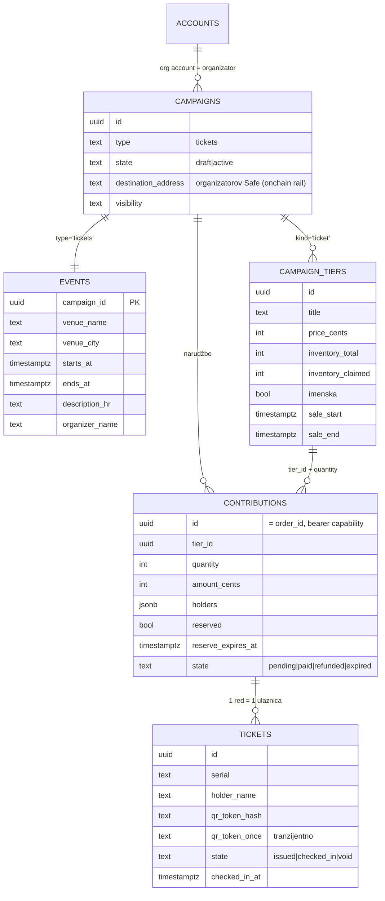

# 05 — Podatkovni model

> Datum: 2026-08-03 · Izvor istine: `domovina-api`, shema `pinka_finance`.
> Migracije koje ovo definiraju (sve deployane 2026-07-17):
> `20260716120000_events_ticketing_schema.sql`, `_rls.sql`, `_rpcs.sql`,
> `20260717120000_events_checkin.sql`, `20260717130000_events_organizer.sql`.

## 1. Postojeće (ne dirati bez razloga)



Postojeći RPC-ovi (svi `security definer set search_path = ''`):

| RPC                          | Uloga                                                            |
| ---------------------------- | ----------------------------------------------------------------- |
| `create_event`               | event + tieri u jednom pozivu, idempotentno po `p_id`             |
| `update_event` / `publish_event` | organizator self-service; publish gated allowlistom + adresom |
| `create_ticket_order`        | narudžba + **rezervacija inventoryja** + oversell check + TTL      |
| `expire_stale_ticket_orders` | vraća istekle rezervacije                                         |
| `confirm_ticket_order`       | onchain put: `(tx_hash, log_index, from, amount)` → izda ulaznice  |
| `deliver_ticket_orders` / `list_my_tickets` | jednokratna dostava QR tokena              |
| `redeem_ticket` / `void_ticket` | check-in s anti-double-entry / poništenje                      |
| `organizer_overview`         | prodaja po tieru za dashboard                                     |
| `upsert_organizer_record`    | DAC7 evidencija                                                   |

Postojeće edge funkcije: `events-feed`, `events-order`, `events-confirm`,
`events-tickets`, `events-checkin`, `events-organizer`.

## 2. Novo za Stripe rail

Jedna migracija, `YYYYMMDDHHMMSS_events_stripe_rail.sql`. Sve idempotentno.

### 2.1 `organizer_payment_rails`

Stripe konfiguracija po org accountu — namjerno **odvojena tablica**, ne kolone na
`accounts`, jer `accounts` je core shema koju dijele svi proizvodi.

```sql
create table if not exists pinka_finance.organizer_payment_rails (
  account_id uuid primary key references public.accounts(id) on delete cascade,
  stripe_account_id text unique,                 -- acct_… ; NIKAD u javnom viewu
  stripe_charges_enabled boolean not null default false,
  stripe_payouts_enabled boolean not null default false,
  invoice_provider text not null default 'organizator',   -- organizator|fira|domovina_fiskal
  invoice_config jsonb,                          -- tenant id / api ključ ref — NIKAD plaintext tajna
  created_at timestamptz not null default now(),
  updated_at timestamptz not null default now(),
  constraint opr_stripe_acct_format check (stripe_account_id is null or stripe_account_id ~ '^acct_[A-Za-z0-9]+$'),
  constraint opr_invoice_provider_chk check (invoice_provider in ('organizator','fira','domovina_fiskal'))
);
```

RLS: čitanje — org admin i service_role; pisanje — **samo service_role** (Stripe
stanje dolazi iz webhooka, ne iz browsera). Javni feed dobiva izvedeni boolean
`stripe_connected`, nikad `acct_…` (pravilo iz `rodjendaonice/worker/bookable.ts`).

### 2.2 `contributions` — rail i vanjska referenca

```sql
alter table pinka_finance.contributions
  add column if not exists payment_rail text not null default 'onchain',   -- onchain|stripe
  add column if not exists external_payment_ref text,                      -- pi_… za stripe
  add column if not exists buyer_email text;                               -- dostava ulaznica (web nema wallet)

-- idempotencija plaćanja = unique u BAZI, ne u kodu (isti princip kao (tx_hash, log_index))
create unique index if not exists ux_contributions_external_payment
  on pinka_finance.contributions (payment_rail, external_payment_ref)
  where external_payment_ref is not null;
```

`payment_rail` s defaultom `'onchain'` znači da postojeći redovi i postojeći
onchain tok ostaju nepromijenjeni.

### 2.3 `confirm_ticket_order_offchain()`

Blizanac `confirm_ticket_order`, ista state-machine i isto izdavanje ulaznica, ali
umjesto `(tx_hash, log_index, from)` prima `(rail, external_ref, payer_email)`.

```sql
create or replace function pinka_finance.confirm_ticket_order_offchain(
  p_order_id uuid,
  p_rail text,               -- 'stripe'
  p_external_ref text,       -- pi_…
  p_amount_cents bigint,
  p_payer_email text default null
) returns jsonb
language plpgsql security definer set search_path = ''
```

Mora zadržati **sve** obrasce originala (provjereno čitanjem
`20260716120200_events_ticketing_rpcs.sql:457`):

1. `select … for update` na narudžbi.
2. Idempotencija: `state='paid'` + isti `external_ref` → `{"status":"already_paid", serials}`.
3. Konflikt: isti `external_ref` na drugoj narudžbi → audit event
   `ticket_order.match_conflict` + `{"status":"tx_already_credited"}`.
4. Manjak iznosa → audit `ticket_order.underpaid` + `{"status":"amount_insufficient"}`.
5. Istekla rezervacija → pokušaj re-rezervacije; ako ne stane →
   `{"status":"expired_sold_out"}` (Worker na to radi **refund**).
6. **Poslovni ne-uspjeh se vraća kao status, NE kao exception** — exception bi
   rollbackao audit zapis. Ta lekcija je već plaćena jednom (doc 13 §3).

### 2.4 Nove edge funkcije

| Funkcija                | `verify_jwt` | Tko zove                    | Što radi                                                             |
| ----------------------- | ------------ | --------------------------- | --------------------------------------------------------------------- |
| `events-stripe-intent`  | false        | naš Worker                  | za `order_id` vrati iznos, tier snapshot i `stripe_account_id` organizatora (uz provjeru `charges_enabled`) |
| `events-stripe-confirm` | false + **HMAC** | naš Worker (nakon verifikacije Stripe potpisa) | zove `confirm_ticket_order_offchain`, vrati serials + jednokratne QR tokene |

⚠️ **Sigurnosna razlika prema onchain putu:** kod `events-confirm` autorizacija je
sam blockchain ("onchain verifikacija JE autorizacija") — klijentu se ne vjeruje
ništa. Kod Stripea toga nema: **jedini dokaz uplate je Stripe webhook potpis, koji
verificira naš Worker.** Zato `events-stripe-confirm` NE smije biti otvorena
funkcija — mora biti zaštićena dijeljenom tajnom (HMAC header ili service-role
ključ) i dostupna isključivo Workeru. Ovo je najosjetljivija točka cijelog dizajna.

## 3. Što ostaje u ovom repou (ne u `pinka_finance`)

| Podatak                                    | Gdje                      | Zašto                                            |
| ------------------------------------------ | ------------------------- | ------------------------------------------------ |
| Stripe webhook event log (raw)             | D1 ili KV u Workeru       | operativni trag, ne domenski podatak             |
| Poslani e-mailovi / podsjetnici            | D1                        | isto                                             |
| Brand postavke prodajne stranice           | D1                        | prezentacija, ne ticketing                       |
| Rate-limit brojači                         | KV                        | efemerno                                         |
| **Ulaznice, narudžbe, inventory**          | **nikad ovdje**           | jedan izvor istine (v. [02](02-arhitektura.md) §1) |

## 4. Migracijski put s FIRA/Forms toka

Za prvog tenanta (Prilika za Susret) potreban je uvoz postojećih prijava iz Google
Sheeta u `contributions` + `tickets` sa stanjem `paid` (uplate su već primljene na
IBAN). To je jednokratna skripta, ne značajka proizvoda — planirano u U3 kao
"uvoz postojećih prijava (CSV)". Bez toga organizator ne može preći usred sezone.
