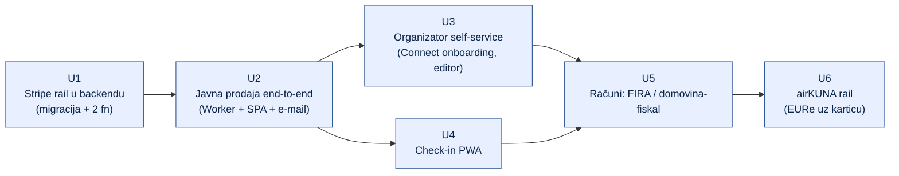

# 06 — Faze i roadmap

> Datum: 2026-08-03 · Format faza preslikan iz
> `safe-wallet-monorepo/docs/whitelabel-wallet/handoffs/` (dokazano: E1–E4 su tim
> formatom izvršene autonomno u jednom danu — v. doc 13).

## 1. Mapa

| #   | Faza                        | Handoff                                                             | Ovisi o        | Repo(i)                        | Status |
| --- | --------------------------- | -------------------------------------------------------------------- | -------------- | ------------------------------ | ------ |
| U1  | Stripe rail u backendu      | [u1-stripe-rail-backend.md](handoffs/u1-stripe-rail-backend.md)      | —              | `domovina-api`                 | ⬜     |
| U2  | Javna prodaja end-to-end    | [u2-javna-prodaja-web.md](handoffs/u2-javna-prodaja-web.md)          | U1             | ovaj repo                      | ⬜     |
| U3  | Organizator self-service    | [u3-organizator-dashboard.md](handoffs/u3-organizator-dashboard.md)  | U2             | ovaj repo (+ `domovina-api`)   | ⬜     |
| U4  | Check-in PWA                | [u4-checkin-pwa.md](handoffs/u4-checkin-pwa.md)                      | U2             | ovaj repo                      | ⬜     |
| U5  | Računi / fiskalizacija      | [u5-racuni-fiskalizacija.md](handoffs/u5-racuni-fiskalizacija.md)    | U3, U4         | ovaj repo (+ `domovina-fiskal`)| ⬜     |
| U6  | airKUNA rail                | [u6-airkuna-rail.md](handoffs/u6-airkuna-rail.md)                    | U2             | ovaj repo + `safe-wallet-monorepo` | ⬜ |

## 2. Definicija MVP-a (U1–U2)

> Organizator ima Stripe Connect račun i objavljen event s dva tiera. Posjetitelj
> otvori javni link, odabere tier i količinu, upiše imena holdera za imenski tier,
> plati karticom kroz Stripe Checkout (naplata **na račun organizatora**, bez ijedne
> naknade platforme), i u roku od nekoliko sekundi dobije e-mail s QR ulaznicama.
> Inventory se ne može prepodati, dvostruka dostava webhooka ne izda duple ulaznice,
> a ako je tier u međuvremenu rasprodan — kupac dobije automatski povrat.

Sve ostalo (dashboard, skener, računi) dolazi poslije. Prvi pilot: jedan stvarni
događaj Prilike za Susret ili BlockSplit/MoMo (kontakt već postoji).

## 3. Redoslijed i zašto baš takav

1. **U1 prije U2** — bez `payment_rail` i `confirm_ticket_order_offchain` web nema
   što zvati; a te promjene su male i u tuđem repou, pa idu izolirano.
2. **U4 paralelno s U3** — ne dijele datoteke (skener je zaseban route + zaseban
   auth put), pa mogu ići istovremeno.
3. **U5 nakon U3/U4** — račun se izdaje na naplaćenu narudžbu, a odluka o
   provideru je postavka organizatora koja živi u dashboardu.
4. **U6 zadnji** — airKUNA R4 (Događaji) je u roadmapu walleta planiran za
   ožujak–travanj 2027. (`17-airkuna-roadmap.md`), dakle nema smisla ranije; a
   backend za to već radi.

## 4. Prihvatni kriteriji po fazi (sažetak)

| Faza | Gotovo kad…                                                                                              |
| ---- | -------------------------------------------------------------------------------------------------------- |
| U1   | curl scenarij prolazi: order → stripe-confirm → 2 ulaznice; ponovljeni confirm = `already_paid`; underpaid i `expired_sold_out` vraćaju status, ne exception |
| U2   | Stripe test kartica → e-mail s QR-om; dupli webhook ne duplicira; rasprodan tier → automatski refund       |
| U3   | Organizator bez ijednog SQL-a: spoji Stripe, kreira event, objavi ga, vidi prodaju i izveze popis holdera |
| U4   | Prvi sken ✅ s imenom holdera, drugi ⛔ s vremenom prvog ulaska; ne-admin odbijen                          |
| U5   | Naplaćena narudžba proizvede račun kroz odabrani provider; TEST okolina; storno na refund                 |
| U6   | Isti event nudi "plati karticom" i "plati iz walleta"; obje staze daju identičnu ulaznicu i check-in       |

## 5. Ručni preduvjeti (vlasnik, ne agent)

| #   | Preduvjet                                                                    | Blokira | Status |
| --- | ----------------------------------------------------------------------------- | ------- | ------ |
| 1   | Stripe platform račun + **test** ključevi, Connect uključen                    | U1/U2   | ⬜     |
| 2   | SSH pristup `domovina-api` produkciji (migracije + deploy funkcija)            | U1      | ⬜     |
| 3   | Cloudflare projekt + domena (npr. `ulaznice.domovina.ai`)                      | U2      | ⬜     |
| 4   | Pilot organizator + org account u `public.accounts` (+ allowlist)              | U2      | ⬜     |
| 5   | Odgovori na ⚠️ ODLUKE 1–2 iz [04](04-porezni-i-pravni-okvir.md) §6             | live    | ⬜     |
| 6   | Uvjeti korištenja + politika privatnosti                                       | launch  | ⬜     |
| 7   | Potvrda da Stripe Express onboarding prolazi za hrvatske **udruge**            | U3      | ⬜     |

## 6. Rizici

| Rizik                                                                 | Ublažavanje                                                                    |
| --------------------------------------------------------------------- | ------------------------------------------------------------------------------- |
| Stripe odbije Express onboarding za udruge                             | provjeriti odmah (preduvjet 7); fallback = organizator koristi vlastiti Stripe račun (standard onboarding) |
| `events-stripe-confirm` izložena bez zaštite = besplatne ulaznice      | HMAC/service-role, nikad otvorena funkcija ([05](05-podatkovni-model.md) §2.4)   |
| Ovisnost o self-hosted serveru (SSH deploy, dostupnost)                | statusna stranica + rekoncilijacija; katalog se može cacheati na edgeu           |
| Fiskalizacija zablokira launch                                          | `InvoiceProvider = organizator` je zadano — proizvod radi i bez naše fiskalizacije |
| Dvostruki proizvod (wallet events vs web ulaznice) razilazi se u modelu | jedna baza; wallet i web su dva klijenta iste jezgre                             |
