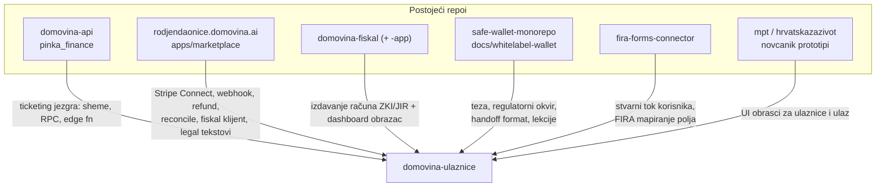

# 07 — Prior art i reuse mapa

> Datum: 2026-08-03 · Svrha: da nijedan agent ne izmisli ono što u ekosustavu već
> postoji, i da zna **odakle točno** kopirati obrazac. Sve putanje su provjerene
> čitanjem 2026-08-03.

## 1. Odakle što dolazi

## 2. Tablica preuzimanja

| Što trebamo                        | Odakle (točna putanja)                                                                     | Kako koristiti                                     |
| ---------------------------------- | -------------------------------------------------------------------------------------------- | --------------------------------------------------- |
| Ticketing shema i RPC-ovi          | `domovina-api/supabase/migrations/20260716120000_events_ticketing_schema.sql` (+ `_rls`, `_rpcs`, `20260717120000_events_checkin.sql`, `20260717130000_events_organizer.sql`) | **koristiti kakvi jesu**, proširiti minimalno       |
| API ugovor + smoke scenarij        | `domovina-api/docs/events-ticketing-curl-scenario.md`                                          | predložak za U1 verifikaciju                        |
| Deploy backenda                    | `domovina-api/scripts/db-migrate.sh`, `deploy-functions.sh`                                    | `--dry-run` pa pravi run; zadnji deploy `--restart -y` |
| Stripe Connect onboarding          | `rodjendaonice/apps/marketplace/worker/stripe.ts::onboardingLink()`                            | kopirati, promijeniti MCC i URL-ove                 |
| Checkout session                   | isti file, `createCheckout()`                                                                   | **promijeniti u direct charge**, izbaciti fee       |
| Webhook verifikacija i rukovanje   | `rodjendaonice/apps/marketplace/worker/webhooks.ts`                                             | kopirati strukturu, dodati `account` (Connect)      |
| Refund                             | `rodjendaonice/apps/marketplace/worker/refunds.ts`, `stripe.ts::refundPaymentIntent()`         | **bez** `reverse_transfer` / `refund_application_fee` |
| Rekoncilijacija (cron)             | `rodjendaonice/apps/marketplace/worker/reconcile.ts` + `worker-tests/reconcile.test.ts`         | obrazac provjera 1:1                                |
| "Nema računa ⇒ ne može se kupiti"  | `rodjendaonice/apps/marketplace/worker/bookable.ts`                                             | isti invariant za `stripe_connected`                |
| Klijent za fiskalizaciju           | `rodjendaonice/apps/marketplace/worker/fiskal.ts` (uklj. `provjeriOkolinu()` bravu)            | kopirati kao `domovina_fiskal` provider             |
| Ugovor fiskal API-ja               | `domovina-fiskal/backend/src/validacija.ts`, `src/api/racuni.ts`, `migrations/0002_dokumenti.sql` | čitati izvor, ne pretpostavljati polja            |
| Dashboard + SSO obrazac            | `domovina-fiskal-app/` (Next 14 `output: "export"`, GoTrue login, `lib/fiskal.ts`)             | obrazac za organizator dashboard                    |
| Pravni tekstovi (uvjeti/privatnost)| `rodjendaonice/apps/marketplace/src/pages/public/legal/texts.ts`                                | prilagoditi, ne pisati iz nule                      |
| Porezna analiza marketplacea       | `rodjendaonice/docs/marketplace/porezni-model.md`                                              | temelj za [04](04-porezni-i-pravni-okvir.md)        |
| Teza, regulatorni okvir, rizici    | `safe-wallet-monorepo/docs/whitelabel-wallet/11-dogadjaji-p2p-ticketing.md`                     | izvorni plan (P2P varijanta)                        |
| Runbook onboardinga organizatora   | isti folder, `12-onboarding-organizatora.md`                                                   | predložak za U3 upute organizatoru                  |
| Procesne i tehničke lekcije        | isti folder, `13-lekcije-sesije-dogadjaji.md`                                                  | **pročitati prije U1** — štedi ponovne greške       |
| FIRA payload i mapiranje polja     | `fira-forms-connector/google-apps-script/modules/Mapping.gs`, `examples/fira-custom-api-openapi-spec.txt` | osnova za `fira` invoice provider           |
| Stvarni cjenovni razredi po datumu | `fira-forms-connector/google-apps-script/events/*/Config.gs`                                    | dokaz da `sale_start`/`sale_end` model odgovara     |
| UI obrasci "Karte" / "Na koncertu" | `mpt-novcanik-wallet`, `hrvatskazazivot-novcanik-zivot-prototip`                                | vizualni presedan za listu ulaznica i ulaz          |

## 3. Ono što se NE preuzima (i zašto)

| Iz                                   | Što                                     | Zašto ne                                                                 |
| ------------------------------------ | ---------------------------------------- | ------------------------------------------------------------------------- |
| `rodjendaonice`                      | destination charge + `application_fee`   | mi imamo 0 % → direct charge je ispravniji ([03](03-stripe-connect-0-posto.md)) |
| `rodjendaonice`                      | `capture_method: 'manual'`               | nema "potvrde organizatora" kod ulaznica                                  |
| `rodjendaonice`                      | vlastita D1 domenska shema za narudžbe   | jezgra je u `pinka_finance`                                               |
| `safe-wallet-monorepo`               | EIP-681 / Send flow / Safe onboarding    | tek U6; web kupac nema wallet                                             |
| `fira-forms-connector`               | Google Apps Script pristup               | zamjenjujemo ga, ne proširujemo                                            |

## 4. Lekcije koje vrijede i ovdje (iz doc 13)

1. **Handoff mora pokazivati na presedan u kodu** ("kopiraj obrazac X iz datoteke Y"),
   ne opisivati želje.
2. **Zapisnik izvršenja je ugovor između faza** — svaka faza upisuje odluke,
   odstupanja i gotchae u svoj Zapisnik.
3. **Poslovni ishodi kao status jsonb, ne exceptioni** u SQL RPC-ovima — exception
   rollbacka audit zapis.
4. **Idempotencija ide na unique index u bazi**, ne u aplikacijski kod.
5. **Faze koje diraju iste datoteke idu sekvencijalno**; istraživanje paralelno.
6. `domovina-api` deploy: `db-migrate.sh --dry-run` → `db-migrate.sh` →
   `deploy-functions.sh --only=<fn>` (zadnja s `--restart -y`).
