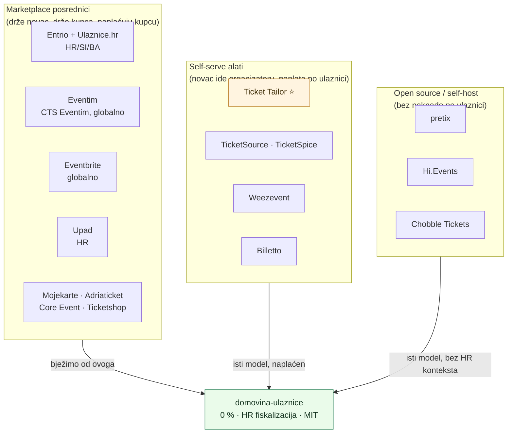
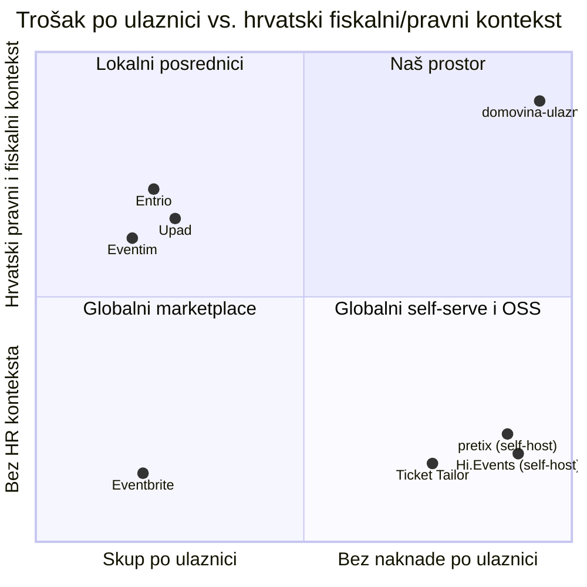

# 08 — Konkurencija i tržište

> Datum snimke: **2026-09-06**. Sve cijene i naknade su preslikane s izvora na taj
> dan i **zastarijevaju brzo** — svaki iznos ima izvor i datum. Prije nego se broj
> iz ove tablice upotrijebi u prodajnom razgovoru, provjeri ga na izvoru.
>
> Vezano: [01 Vizija i model](01-vizija-i-model.md) §1 (teza),
> [09 Usporedba s Ticket Tailorom](09-usporedba-ticket-tailor.md) (detaljna
> funkcionalna usporedba s najbližim konkurentom).

---

## 1. Zaključak prvo

1. **Ticket Tailor je naš najbliži konkurent, ne Entrio.** Isti model (organizator
   je merchant of record, novac ide izravno na njegov Stripe, platforma ne dira
   sredstva), samo naplaćen po ulaznici umjesto 0. Funkcionalno su daleko ispred
   nas — v. [09](09-usporedba-ticket-tailor.md).
2. **Naša cjenovna prednost je velika naspram lokalnih posrednika, mala naspram
   Ticket Tailora.** Na 100 ulaznica po 50 €: Entrio kupcu naplati ~275 € naknade,
   Ticket Tailor organizatoru ~70 €, mi 0 €. Razlika prema TT-u (~70 €) nije
   argument koji sam po sebi mijenja odluku — razlika prema Entriju (~275 € koje
   plaća kupac) jest.
3. **Prava obrana nije cijena nego hrvatski fiskalni i pravni kontekst.** Nijedan
   globalni igrač ne rješava fiskalizaciju 2.0, FIRA/`domovina-fiskal` most, ni
   pitanje tko je obveznik kad ulaznicu prodaje posrednik. To je jedini dio gdje
   smo strukturno neponovljivi za TT ili Eventbrite, a za PzS je preduvjet, ne
   dodatak (v. [plan do produkcije](2026-09-03-plan-do-produkcije.md) §3.8).
4. **Segment koji nitko ne opslužuje dobro** je hrvatska udruga / manji organizator
   koji danas vozi Google Forms + IBAN + ručni račun. Za njih je Entrio preskup i
   prevelik, Ticket Tailor je na engleskom i bez HR računa, a Eventbrite je
   marketplace koji im uzima odnos s kupcem.

---

## 2. Mapa tržišta

Tri osi po kojima se dijeli tržište:

| Os | Krajnosti | Gdje smo mi |
| --- | --- | --- |
| **Tko drži novac** | posrednik drži do isplate ↔ novac ide izravno organizatoru | izravno organizatoru (direct charge) |
| **Tko plaća naknadu** | kupac (booking fee) ↔ organizator (po ulaznici / pretplata) ↔ nitko | nitko, zasad |
| **Tko je publika** | marketplace donosi promet ↔ alat samo prodaje tvojoj publici | alat; promet je organizatorov |

**Posljedica koju treba priznati:** mi smo alat, ne marketplace. Organizator koji
od posrednika očekuje **publiku** (Entrio ima promet, Eventim ima Tisak prodajna
mjesta) kod nas je ne dobiva. Ne prodajemo doseg, prodajemo to da naknada nestane
i da račun bude ispravan.

---

## 3. Hrvatska i regija

| Proizvod | Tko | Model | Naknada (snimka 2026-09-06) | Pouzdanost |
| --- | --- | --- | --- | --- |
| **Entrio** | Entrio Technologies, spojen s Ulaznice.hr u Invera grupaciju; HR/SI/BA, ~4 mil. ulaznica / 13.000 događaja godišnje | marketplace + self-service manager | **Kupcu:** ≤ 15 € → 10 % bruto cijene; > 15 € → 1 € fiksno + 3,5 %. Nepovratna. **Organizatoru:** provizija, prijavljeno ~8,5 % + PDV, pregovorljivo po volumenu | naknada kupcu: **visoka** (Opći uvjeti §4.10); provizija organizatoru: **niska** (sekundarni izvor) |
| **Ulaznice.hr** | Dekod; spojen s Entriom (2024/25) | marketplace, fizička prodajna mjesta | nije javno | niska |
| **Eventim** | CTS Eventim (DE), HR podružnica | marketplace, veliki venue/promotor posao | nije javno | niska |
| **Upad** | Upad d.o.o., HR | marketplace, klupski/koncertni fokus (Arena Zagreb i sl.) | Opći uvjeti navode pravo naplate naknade uz kupoprodajnu cijenu; iznos nije javno naveden | niska |
| **Mojekarte** | Rijeka | marketplace | nije javno | niska |
| **Adriaticket** | Prstac | marketplace, Tisak distribucija | nije javno | niska |
| **Core Event** | HR | ticketing + Tisak distribucija | nije javno | niska |
| **Ticketshop** | Event Masters | ticketing + Tisak distribucija | nije javno | niska |

**Što ovo znači za nas:**

- Domaće tržište je **konsolidirano** (Entrio + Ulaznice.hr) i naplaćuje **kupcu**,
  ne organizatoru. Zato je naš argument prema organizatoru zapravo argument o
  **njegovim kupcima**: „tvoj posjetitelj plaća 2,75 € manje po ulaznici".
- Nitko od lokalnih ne nudi **samouslužni bijeli label na organizatorovoj domeni**
  s novcem koji ide izravno njemu. Svi su marketplace.
- Distribucija preko **Tisak Media** je stvarna prednost lokalnih igrača za
  publiku koja ne kupuje online. Nemamo je i nećemo je imati.
- Entrio funkcionalno pokriva ono što nama nedostaje (sjedala, promo kodovi,
  zonska kontrola pristupa, SkiData integracija, analitika, Mailchimp) — v.
  entrio.com/entertainment/features. Ne natječemo se s time; natječemo se za
  događaje kojima to ne treba.

### Provjeriti prije korištenja u prodaji

Entrio naknada iz Općih uvjeta (1 € + 3,5 %) daje **2,72 € na ulaznicu od 49 €** —
što se točno poklapa s našom snimkom MoMo studentske ulaznice (README, 2026-07-16).
Ali ista formula na 149 € daje **6,22 €**, a snimljeno je **4,00 €**. Dakle postoji
ili gornji prag ili pregovorena stopa po događaju. **Ne tvrditi da veliki događaj
plaća 3,5 % dok se to ne provjeri.**

---

## 4. Globalni self-serve igrači (naš stvarni model)

| Proizvod | Naknada (snimka 2026-09-06) | Novac | Bilješka |
| --- | --- | --- | --- |
| **Ticket Tailor** ⭐ | 0,22–0,60 £ po prodanoj ulaznici (kredit unaprijed vs. pay-as-you-go), + PDV; besplatno do 5.000 besplatnih ulaznica/god.; 50 % popust za dobrotvorne i za jeftine ulaznice; rezervirano sjedalo = dodatni kredit | izravno na Stripe/PayPal/Square organizatora, TT ne dira sredstva | **Naš najbliži konkurent.** B Corp, 73.000+ organizatora, 24/7 podrška, otvoreni API, MCP konektor. Detaljna usporedba: [09](09-usporedba-ticket-tailor.md) |
| **Eventbrite** | postotak + fiksno po ulaznici, marketplace | drži pa isplaćuje | najveći; organizator gubi dio odnosa s kupcem; TT ga otvoreno cilja |
| **TicketSpice** | ~1 $ po ulaznici | izravno (WePay/Stripe) | US fokus |
| **TicketSource** | naknada po ulaznici | izravno | UK |
| **Weezevent** | postotak + fiksno | miješano | FR/EU, jak u festivalima i cashlessu |
| **Billetto** | postotak kupcu | drži pa isplaćuje | Skandinavija/UK |
| **Ticketsauce** | white label, licenca | izravno | ističe 100 % vlasništvo nad podacima kupaca |
| **Checkout Page / eventcloud** | mjesečna pretplata, 0 € po ulaznici | izravno na Stripe organizatora | najbliži našem cjeniku; dokaz da je „pretplata umjesto po ulaznici" održiv model |

**Nalaz koji mijenja pozicioniranje:** postoji cijela kategorija koja već radi ono
što mi radimo (novac izravno organizatoru, bez booking feeja kupcu). Naša
diferencijacija **nije** „prvi bez posrednika" — to je Ticket Tailor od 2010. Naša
diferencijacija je **0 € po ulaznici + hrvatski račun + hrvatski jezik**.

---

## 5. Open source / self-host

| Projekt | Licenca | Bilješka |
| --- | --- | --- |
| **pretix** | AGPL-3.0 | najzreliji. Njemački, jak na fiskalnim/poreznim detaljima za DE, plugin arhitektura, REST API. Hosted: 2,5 % po plaćenoj ulaznici (max 15 €). Napredno (sjedala, POS, badge, preprodavači) traži **Enterprise licencu od ~499 €/god.** |
| **Hi.Events** | AGPL-3.0 + dodatni uvjeti | moderna alternativa Eventbriteu/TT-u; self-host = bez naknada, plaćanja idu izravno na organizatorov Stripe; postoji i managed cloud |
| **Chobble Tickets** | open source | mali, jednostavan |
| **domovina-ulaznice** | **MIT** | permisivnija licenca od oba gornja. Repo je javan (`domovinatv/domovina-ulaznice`) |

**Za znati:** self-host s AGPL-om je stvarna alternativa organizatoru koji ima IT
podršku, i to besplatno. Prema njima naša prednost **nije** cijena nego (a) ništa
se ne hostira — Cloudflare Worker, (b) HR fiskalizacija, (c) MIT umjesto AGPL-a.

---

## 6. Gdje je naš prostor

Naš kvadrant je uzak, ali je prazan: **0 € po ulaznici i hrvatski račun**.

Tri stvari koje moramo zadržati da ostane prazan:

1. **FIRA / `domovina-fiskal` most.** Ovo je jedina prednost koju Ticket Tailor ne
   može kopirati preko noći, jer traži lokalno poznavanje propisa i integracije.
   `worker/racun.ts` + `worker/racun-fira.ts` su zato strateški kod, ne pomoćni.
2. **Hrvatski kao prvi jezik**, uključujući pravne tekstove i podršku.
3. **0 % ostaje.** Čim uvedemo naknadu po ulaznici, spadamo u kategoriju u kojoj
   Ticket Tailor pobjeđuje po svakoj drugoj osi. Monetizacija ide na pretplatu i
   fiskalizaciju kao uslugu ([01](01-vizija-i-model.md) §5) — ne na ulaznicu.

## 7. Čemu se ne natjecati

Ne pokušavati sustići, jer je skupo i ne odlučuje o pilotu:

- **Sjedala.** Ticket Tailor i Entrio imaju drag-and-drop editor tlocrta. To je
  mjesecima posla i ne treba nijednom našem segmentu ([01](01-vizija-i-model.md) §7).
- **Marketplace promet.** Entrio i Eventbrite donose publiku. Mi nikad nećemo.
- **Fizička distribucija** (Tisak Media).
- **Virtualna pozornica / hibridni eventi** (Entrio ima cijelu platformu).
- **Preprodaja i anti-scalping** — postoji prototip, ali je post-MVP.

---

## 8. Izvori

| Izvor | Datum dohvata | Što je uzeto |
| --- | --- | --- |
| [tickettailor.com/features](https://www.tickettailor.com/features) | 2026-09-06 | puni popis funkcija |
| [tickettailor.com/pricing](https://www.tickettailor.com/pricing) | 2026-09-06 | 0,22–0,60 £/ulaznica, Stripe naknade, popusti |
| [entrio.hr/sales-terms](https://www.entrio.hr/sales-terms) §4.10 | 2026-09-06 | naknada za izdavanje ulaznice (10 % / 1 € + 3,5 %) |
| [entrio.com/entertainment/features](https://www.entrio.com/entertainment/features/) | 2026-09-06 | funkcionalni opseg Entrija |
| [Bug.hr — spajanje Entrio i Ulaznice.hr](https://www.bug.hr/biznis/spajaju-se-tvrtke-za-prodaju-ulaznica-entrio-i-ulaznicehr-45482) | 2026-09-06 | konsolidacija tržišta, veličina |
| [Bloomberg Adria — Invera grupacija](https://hr.bloombergadria.com/biznis/kompanije/72079/invera-udruzivanjem-entrija-i-ulaznicahr-stvara-vodecu-ticketing-grupaciju/news) | 2026-09-06 | popis igrača na HR tržištu |
| [Upad — Opći uvjeti za kupce (PDF)](https://assets.upad.hr/Opci-uvjeti-poslovanja-za-kupce.pdf) | 2026-09-06 | Upad je posrednik, naplaćuje naknadu |
| [Tisak — ulaznice](https://www.tisak.hr/usluga/ulaznice/) | 2026-09-06 | distributeri: Eventim, Ticketshop, Adriaticket, Ulaznice.hr, Entrio, Core Event |
| [hi.events/open-source-event-ticketing](https://hi.events/open-source-event-ticketing) | 2026-09-06 | self-host, AGPL, izravni Stripe |
| [docs.pretix.eu](https://docs.pretix.eu/) | 2026-09-06 | AGPL, hosted 2,5 %, Enterprise licenca |
| [Porezna uprava — Fiskalizacija 2.0](https://porezna.gov.hr/fiskalizacija/bezgotovinski-racuni) | 2026-09-06 | obveznik je isporučitelj, posrednik fiskalizira u ime obveznika |
| `README.md`, `docs/01` §2 | — | vlastite snimke Entrio naknada (MoMo, 2026-07-16) |
