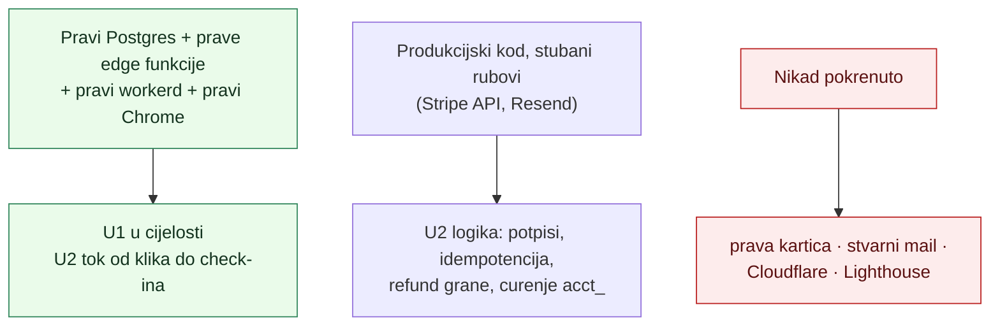
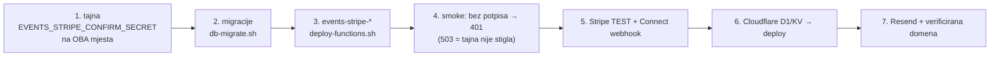

# 2026-08-04 — Lokalna verifikacija U1+U2: nalazi, odbačene alternative, otvoreno

> Što bi sljedeći prolaz inače morao ponovno otkriti. Kronologija je u git
> povijesti; ovdje su **odluke, mjerenja i zamke**.
> Vezani dokumenti: [handoff U1](handoffs/u1-stripe-rail-backend.md),
> [handoff U2](handoffs/u2-javna-prodaja-web.md),
> [izvještaj sa snimkama](izvjestaji/2026-08-04-lokalni-test-u1-u2.pdf),
> [02 — Arhitektura](02-arhitektura.md), [03 — Stripe 0 %](03-stripe-connect-0-posto.md).

## 1. Što je stvarno dokazano, a što nije

Tri različite razine pouzdanosti — bez ovog razlikovanja izvještaj se lako
pročita prejako:

Ključno: **mockovi ne glume poslovnu logiku.** `fake-stripe` samo bilježi što mu
Worker pošalje — zato iz njega ispada dokaz da `application_fee_amount` i
`transfer_data` nisu poslani, što je cijeli porezni argument proizvoda.

## 2. Bug koji su testovi propustili

48 testova sa stubovima je prolazilo. Prva **stvarna** narudžba je pala.

Worker je prema `events-order` slao `Authorization: Bearer <service key>`. Ta
funkcija na prisutan Authorization prelazi na "user klijent" granu i zove
`auth.getUser()` — pogrešan put (web kupac je gost bez računa) i **500** ako u
okruženju funkcije nema `SUPABASE_ANON_KEY`.

Zašto ga stub nije uhvatio: stub je prihvaćao i jedan i drugi oblik zaglavlja, pa
je razlika bila nevidljiva. **Pouka:** stub koji je popustljiviji od stvarne
implementacije pretvara test u potvrdu vlastite pretpostavke. Regresijski test sad
tvrdi negativ (`Authorization === undefined`), ne samo pozitiv.

## 3. Odbačene alternative

| Odbačeno | Zašto |
| --- | --- |
| `void_ticket` za poništenje ulaznica na povrat | traži `auth.uid()` + org admin rolu; service ključ nema `auth.uid()` → uvijek `not_authenticated`. Zamijenjeno RPC-om `refund_ticket_order` koji radi cijelu narudžbu u jednoj transakciji. |
| Exception na drugu uplatu već plaćene narudžbe (kako radi onchain blizanac) | kod Stripea je to stvarno dvaput naplaćen kupac; exception bi rollbackao upravo onaj audit zapis na temelju kojeg Worker radi refund. Vraća se status `duplicate_payment`. |
| Prikaz QR-a na stranici narudžbe | `events-tickets` troši jednokratne tokene — prvi refresh bi ih potrošio i e-mail bi ostao bez QR-a. Stranica čita stanje PostgREST-om, tokene ne dira. |
| `data:` URI za QR u e-mailu | Gmail i Outlook blokiraju `data:` u ``. Koristi se PNG privitak s `content_id` (`cid:`). |
| `pngjs` / `canvas` za generiranje PNG-a | vuku native/stream API koji Workers runtime nema. Napisan vlastiti enkoder: 1-bitni grayscale, "stored" deflate blokovi, ~3 kB po ulaznici. Test dekomprimira IDAT `node:zlib`-om i provjerava piksele. |
| Puppeteerov Chromium (~150 MB) | `puppeteer-core` + sistemski Chrome radi isto bez preuzimanja. |
| Otvaranje GitHub repoa za `domovina-ulaznice` | vanjska radnja koju odlučuje vlasnik. |

## 4. Zamke koje su koštale vremena

- **Docker registry nedostupan** (i unutar i izvan sandboxa) → nema slika
  `edge-runtime` i `imgproxy`. Rješenje: `supabase start -x edge-runtime,imgproxy,…`
  + funkcije vožene Denom. `Deno.serve` je getter-only property — patch ide preko
  `Object.defineProperty`, pridruživanje baca `TypeError`.
- **Zaostao lokalni volumen**: migracije primijenjene do pola, jedna postojeća puca
  s "cannot drop columns from view". `supabase db reset` je brži put od krpanja.
- **`export … && nohup … &`** — `&` završava cijeli lanac, pa drugi pozadinski
  proces ne naslijedi `export`e. Rezultat je bio 503 iz funkcije kojoj je
  nedostajala tajna, što izgleda kao greška u kodu.
- **Stripe SDK form-encoding**: parametri su `line_items[0][price_data][unit_amount]`,
  ne `unit_amount`. Assert nad sirovim stringom tijela je krhak — parsirati
  `URLSearchParams`.
- **`create_ticket_order` nema rate limit za web gosta**: postojeći limit veže se na
  `contributor_account_id` ili `declared_payer_address`, a web kupac nema ni jedno →
  uvjet je uvijek prazan. Rate limiting je obaveza Workera (KV, fail-open).

## 5. Mjerenja

| Što | Vrijednost |
| --- | --- |
| SPA bundle | 179 kB, **58 kB gzip** (bez UI biblioteke) |
| QR PNG po ulaznici | ~3 kB (1-bitni grayscale, stored deflate) |
| Testovi | 50, ~1,2 s, bez mreže |
| Rezervacija vs Stripe checkout TTL | 20 min vs **min. 30 min** — prozor u kojem uplata stiže na isteklu rezervaciju je strukturan, ne bug |
| Kapacitet stvarnog susreta | 400 (objavljeni očekivani broj sudionika) |

## 6. Konvencija: datum bez satnice

Organizatori objave datum puno prije satnice. Da sustav u tom slučaju prikaže
"12. 02. 2027. u 00:00", izmislio bi podatak.

**Konvencija:** vrijeme `00:00` u zoni događaja znači "satnica nije objavljena" →
prikazuje se samo datum, odnosno raspon ("12. – 14. veljače 2027."). Vrijedi
jednako u SPA (`src/lib/api.ts::terminHr`) i u e-mailu
(`worker/mail.ts::formatWhenHr`). Pokriveno testom.

Ograničenje: događaj koji doista počinje u ponoć prikazat će se bez vremena. Za
ticketing je to prihvatljiva zamjena; ako ikad zasmeta, treba zasebna zastavica
`satnica_objavljena` u shemi, ne heuristika.

## 7. Otvoreno — čeka odluku ili vlasnika

1. **Stripe-only organizator ne može objaviti događaj.** `publish_event` i trigger
   `campaigns_write_guard` traže pravi Safe (`0x…`, ne nulta adresa) — nasljeđe
   onchain raila. Udruga bez novčanika zapinje. Prijedlog za U3: gate na "barem
   jedan radni rail" — Safe **ili** `organizer_payment_rails.stripe_charges_enabled`.
   Za pilot se aktivira kroz psql (trigger preskače ne-`authenticated` pozivatelje).
2. **QR se izdaje jednom.** Neuspio e-mail = izgubljen QR; `pending_deliveries`
   bilježi dug, cron ga **prijavljuje** ali ne može popraviti. Ako se pokaže čestim
   → rotacija tokena pri autoriziranoj re-dostavi.
3. **`events-feed` ne zna za Stripe**, pa Worker radi dodatan upit po eventu za
   kupovnost. Kod većeg kataloga treba `stripe_connected` u feedu.
4. **Cjenik i satnica stvarnog susreta** (Zagreb, 12.–14. 2. 2027.) nisu objavljeni.
   Iznosi u seedu preuzeti su s vikend susreta Šibenik 2026. istog organizatora i to
   piše u opisu na stranici. Ne pušta se javno dok organizator ne potvrdi.
5. **`payment_rail` dopušta samo `('onchain','stripe')`.** U3 (CSV uvoz postojećih
   prijava) i U6 (airKUNA) trebaju jednolinijsku dopunu constrainta.
6. **`domovina-ulaznice` nema git remote** — sve živi lokalno.

## 8. Redoslijed puštanja u pogon (ne mijenjati)

Tajna mora postojati **prije** funkcija (inače 503), a backend **prije** Workera
(inače Worker nema s čim razgovarati). Webhook u Stripeu mora biti **Connect**
endpoint — inače eventi ne nose `account: acct_…` i povrat se ne može izvesti.
