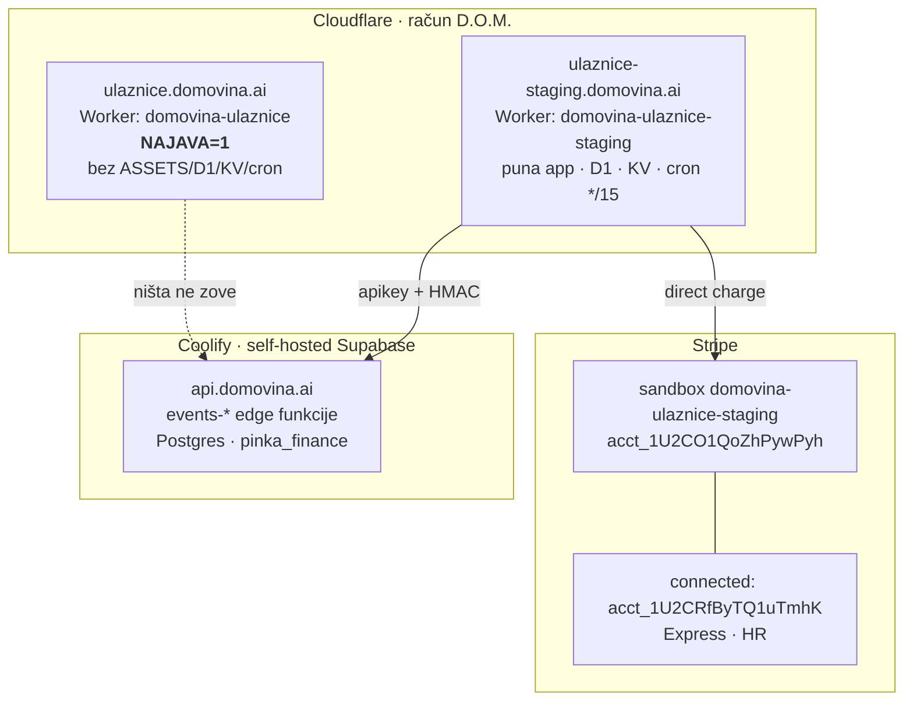

# Prvi deploy, razdvajanje okruženja i Stripe sandbox

> Datum: 2026-08-08 · Sesija: od „nije nigdje deployano" do žive staging aplikacije.
> Vezani dokumenti: [02 — arhitektura](02-arhitektura.md),
> [03 — Stripe Connect](03-stripe-connect-0-posto.md),
> [04 — porezni okvir](04-porezni-i-pravni-okvir.md),
> [nalazi lokalne verifikacije](2026-08-04-lokalna-verifikacija-i-nalazi.md).

Ovaj dokument bilježi ono što se **ne vidi iz diffa**: zašto su okruženja
razdvojena baš ovako, koje su zamke pojele vrijeme, i koja su pitanja otvorena
prije nego se pusti prvi pravi organizator.

---

## 1. Što je od ovog datuma živo



| Resurs | Vrijednost |
| --- | --- |
| Cloudflare račun | D.O.M. `7dc7167b7e2e00923bfa7cd697df14e4` |
| D1 staging | `domovina-ulaznice-staging` `f9c7a381-d75e-4a74-9ddc-62482313d875` (WEUR) |
| D1 produkcija (rezerviran) | `domovina-ulaznice` `2c01251e-133a-42db-9d1e-70cfe47db223` (EEUR) |
| KV staging | `2ea2e4ca9048414faa78a9be870722aa` |
| Stripe sandbox | `acct_1U2CO1QoZhPywPyh` |
| Connected (PzS test) | `acct_1U2CRfByTQ1uTmhK` |
| Connect webhook | `we_1U2CSIQoZhPywPyhprOeashs` |

Zonski ID `domovina.ai`: `2eaa51e7e6896da6e92bde2ddd879cd8`.

---

## 2. Zašto produkcija servira samo najavu

Prvi deploy je pustio **punu aplikaciju** na `ulaznice.domovina.ai`. Izgledala je
kao radna trgovina, a iza nje nije bilo Stripe ključeva — kupac bi kliknuo „Kupi"
i dobio grešku. Domena je javna, pa je to obećanje koje se ne drži.

Odbačene alternative:

| Opcija | Zašto ne |
| --- | --- |
| Ugasiti domenu do puštanja | Vlasnik želi da link postoji za pokazati |
| Produkcijska domena → staging Worker | Vraća točno onaj problem koji rješavamo |
| Zaseban „najava" Worker | Drugi skript i drugi deploy za 30 redaka HTML-a |

Odabrano: **`NAJAVA=1` var + izostavljeni bindingi.** Produkcijski Worker nema
ASSETS, D1, KV ni cron — prodajna infrastruktura tamo **fizički ne postoji**, nije
samo skrivena. `/api/*` i `/webhook/*` vraćaju **404, ne 503**: 503 poziva na
ponovni pokušaj i tvrdi da ruta postoji, a istina je da je u tom okruženju nema.

Guard stoji i na `scheduled` handleru — produkcija danas nema trigger, ali
dodavanje triggera ne smije postati tiha greška.

Pokriveno sa 6 testova (`worker-tests/najava.test.ts`), uključujući da `NAJAVA`
mora biti **točno `"1"`** — `"true"`, `"0"` i prazno znače normalan rad.

## 3. Jedna jezgra za oba okruženja — odluka, ne kompromis

Oba Workera gađaju **isti** `api.domovina.ai`. Vlasnik je to izrijekom odabrao:
jezgra je backend-only i jednog dana drži stvarno plaćene i staging ulaznice
jedne pored drugih; Worker je „samo frontend".

Posljedica koju treba poštovati: **narudžbe iz staginga stvaraju stvarne retke u
`pinka_finance`.** Zato test organizator ima fiksne, prepoznatljive UUID-eve
(`…0000e1/e2`, kampanje `…000f0X`) da se može čisto obrisati.

---

## 4. Zamke koje su pojele vrijeme

### 4.1 Edge funkcije „deployane" ali ne bootaju

Sve `events-*` osim `events-feed` vraćale su:

```
InvalidWorkerCreation: worker boot error: failed to bootstrap runtime:
could not find an appropriate entrypoint
```

Izgleda kao pokvaren kod. **Kod je bio ispravan** — `config.toml` uredan, sve
funkcije deklarirane s `verify_jwt=false`, `index.ts` na mjestu. Uzrok: fileovi
su kopirani u bind-mount, ali edge-runtime ih ne pokupi sam.

Lijek: `./scripts/deploy-functions.sh --restart -y` u `domovina-api`.

### 4.2 Runtime ne čita `supabase/functions/.env`

Nakon restarta funkcije su bootale, ali Stripe rail je vraćao
`secret_not_configured` iako je tajna **bila** u `/home/deno/functions/.env`.
Self-hosted edge-runtime uzima tajne iz **environmenta containera**, ne iz tog
fajla.

Lijek: `./scripts/coolify-env-set.sh KEY=VAL -y --recreate-service=supabase-edge-functions`
(~5 s, ne ruši stack; `--restart` bi dizao sve 2–3 min).

**Ne zaobilaziti preko SSH-a**: Coolify regenerira docker-compose pri deployu, pa
bi ručno postavljena varijabla tiho nestala pri prvom sljedećem deployu.

### 4.3 Coolify API je IP-restricted

`scripts/coolify-*.sh` vraćaju `HTTP 403 {"message":"You are not allowed to access
the API."}` sa svake IP adrese osim dopuštenih
(`domovina-api/docs/security-hardening.md`). **Simptom je identičan neispravnom
tokenu.** Dopuštena IP je dinamička — ovo će se ponoviti.

### 4.4 Edge cache servira staru aplikaciju nakon redeploya

Nakon prelaska produkcije na najavu, `/api/*` je ispravno vraćao 404, ali root je
i dalje servirao **staru SPA iz Cloudflare cachea**. Deploy je bio ispravan.

Provjera: dodaj `?cb=$RANDOM`. Lijek: purge po hostu
(`POST /zones/<zone>/purge_cache` s `{"hosts":[…]}`).

### 4.5 Prolazni 404 i `error code: 1042` odmah nakon deploya

Oba se sama riješe u ~1 min (propagacija). Ne dijagnosticirati ih odmah.

### 4.6 `routes` gasi `*.workers.dev`

Dodavanje custom domene tiho ugasi workers.dev poddomenu. Treba eksplicitni
`"workers_dev": true`.

---

## 5. Stripe sandbox — kako stvarno radi

- Sandbox je **uvijek test mode**; ne postoji način da postane produkcijski.
  Live ostaje isključivo na korijenskom računu.
- **Najviše 5** sandboxova po računu; može se preimenovati i obrisati.
- Pri kreiranju: **„Copying your account"** kopira postavke i capabilities
  (uključujući Connect) — „from scratch" ne kopira ništa.
- `stripe login --project-name <ime>` u sandbox daje profil **samo s test
  ključem**. Login u korijenski račun ostavlja i `live_mode_api_key` u
  `~/.config/stripe/config.toml` — nepotreban rizik.
- Sandbox podaci **se ne sele** u produkciju; za live se radi novi onboarding.

**Sandbox je blaži od produkcije:** ne provodi sve capability provjere i može
dopustiti radnju i kad capability nije `active`. Konkretno — zaštita u
`worker/stripe.ts:100-103` koja odbija checkout bez `charges_enabled` **se u
sandboxu ne može u potpunosti dokazati.**

Dokumentirano ograničenje koje treba pratiti: „ne mogu se stvarati veze između
sandboxa Connect platforme i sandboxa connected accounta."

---

## 6. HMAC šav — potvrđen u produkciji

Pravilo 4 iz `CLAUDE.md` („otvorena funkcija = besplatne ulaznice") sada je
provjereno na živom `api.domovina.ai`, ne samo u testu:

| Zahtjev | Odgovor |
| --- | --- |
| bez `x-ulaznice-signature` | `missing_signature` |
| krivi potpis | `bad_signature` (401, baza netaknuta) |
| **ispravan potpis** | `order_not_found` — prošao autentikaciju, ušao u logiku |

Ako ikad vrati `secret_not_configured`, tajna nije u environmentu containera
(v. §4.2), a ne u `.env` fajlu.

---

## 7. Otvoreno — prije prvog pravog organizatora

### 7.1 Express vs Standard — ovo je najveće

`docs/03` je odabrao **Express + direct charge**. Iz Stripeove tablice tipova
računa, za direct charges:

| | Standard | Express |
| --- | --- | --- |
| Odgovornost za prijevaru i sporove | **connected account** | **platforma** |
| Podržani charge tipovi | direct only | destination, separate, direct |
| Dodatni trošak Stripea | ne | **da** |
| Dashboard organizatora | puni | reducirani |

Uz Express **platforma nosi chargebackove** — na proizvodu s **0 % naknade**, u
kategoriji poznatoj po sporovima. Nula prihoda, sav rizik, plus dodatni trošak.

Standard je obrnut: direct charges su jedini podržani tip (točno naš model),
odgovornost pada na **organizatora** — koji i jest prodavatelj, što se poklapa s
`docs/04` gdje organizator fiskalizira. Uz to dobiva **puni Dashboard**, korisniji
udruzi koja vodi vlastito knjigovodstvo.

Cijena Standarda: organizator mora imati ili otvoriti vlastiti Stripe račun.

Usput: Stripe je tipove računa označio **zastarjelima za nove platforme** i
upućuje na **Accounts v2 API / controller properties**.

### 7.2 Pravni subjekt platforme

Sandbox je pod **italk.hr**. Za produkciju treba odlučiti je li platforma ITalk
ili subjekt Domovine. Platforma je ugovorna strana prema Stripeu i njezin branding
vidi organizator u onboardingu. **Odluku donijeti prije prvog pravog onboardinga**
— connected accounti se ne sele bez ponovnog onboardinga.

### 7.3 SSO za kupca — opcija, ne vrata

Danas je kupac **gost bez računa** (`worker/api.ts:57`); „moje ulaznice" radi
preko order UUID-a kao capability tokena. Prijedlog je koristiti isti GoTrue SSO
kao `domovina.ai`.

Preporuka: **opcionalno, ne obavezno.** Ako prijava postane uvjet za kupnju,
gubi se najjači adut protiv Entrija — kupnja u 30 sekundi bez otvaranja računa.
Prijavljeni dobiva ulaznice vezane uz račun i pregled kupnji; gost kupuje kao i do
sad.

### 7.4 Most narudžba → račun (FIRA) i dalje ne postoji

`invoice_provider` postoji samo kao pročitano polje (`worker/api.ts:187`); ništa
ne izdaje račun. Danas FIRA račun nastaje iz retka u Google Sheetu koji stvori
Forms prijava — **ako prodaja ode na platformu, nema retka → nema računa.**

Prema `docs/04`: obveza fiskalizacije je aktivna od 1. 1. 2026., okidač je **način
naplate** (kartice uključene), obveznik je **organizator**.

Most je jeftin: `fira-forms-connector` već zove
`https://app.fira.finance/api/v1/webshop/order/custom`; isti endpoint može zvati
Worker iz `webhooks.ts` kad uplata sjedne. Presedan za fiskalizaciju u Workeru
postoji u `rodjendaonice/apps/marketplace/worker/fiskal.ts`.

**Za pravi novac ovo je preduvjet, ne poboljšanje.**

### 7.5 Sitnice

- CLI profil `domovina-ulaznice` još drži **live ključ** od italk.hr.
- `wrangler.jsonc` u **javnom** repou sad nosi stvarne D1/KV ID-eve (nisu tajne
  bez API tokena, ali su javne).
- Repo nema `LICENSE` — bez nje „public" nije open source.
- MCC: korišten `7922` (ticket agencies); `docs/03` §8.1 to i dalje traži potvrdu.
