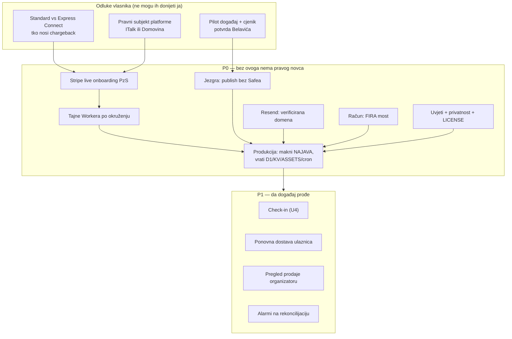

# Plan do produkcije — što još treba da se ulaznica stvarno proda

> Datum: 2026-09-03 · Povod: dogovor s Tomislavom Belavićem (Katolička udruga
> „Prilika za Susret") o stvarnoj prodaji ulaznica kroz ovu aplikaciju.
> Vezano: [02 arhitektura](02-arhitektura.md), [03 Stripe Connect](03-stripe-connect-0-posto.md),
> [04 porezni okvir](04-porezni-i-pravni-okvir.md),
> [stanje deploya](2026-08-08-deploy-okruzenja-i-stripe.md), [handoffs](handoffs/README.md).

Ovaj dokument razdvaja **što je stvarno gotovo** od **što još stoji između koda i
prve naplaćene ulaznice**. Sve tvrdnje o stanju su provjerene na živim sustavima
danas, ne prepisane iz ranijih dokumenata.

---

## 1. Provjereno stanje (2026-09-03)

| Provjera | Naredba / URL | Rezultat |
| --- | --- | --- |
| Testovi | `npm test` | **56/56 prolazi** |
| Staging živ | `GET ulaznice-staging.domovina.ai/api/zdravlje` | `ok:true, api:true, hmac:true` |
| Stripe ključ na stagingu | isto | **`stripe:false`** |
| Webhook tajna na stagingu | isto | **`webhook:false`** |
| Mail ključ na stagingu | isto | **`mail:false`** |
| Tajne Workera | `wrangler secret list --env staging` | samo `DOMOVINA_API_SERVICE_KEY`, `EVENTS_STRIPE_CONFIRM_SECRET` |
| Katalog | `GET /api/dogadjaji` | **`{"events":[]}`** |
| Jezgra | `GET api.domovina.ai/functions/v1/events-feed` | **`{"events":[]}`** — nijedan aktivan događaj |
| Produkcija | `GET ulaznice.domovina.ai/api/zdravlje` | `404` (najava, po planu) |

**Prijevod:** kod je spreman i dokazan, ali **danas se kroz aplikaciju ne može
kupiti ništa** — staging nema Stripe ni mail ključ, a u jezgri nema nijednog
objavljenog događaja. Produkcijska domena je namjerno samo najava.

### Što je stvarno napravljeno (i dokazano testovima)

- **Stripe rail u jezgri (U1)** — `events-stripe-intent` / `-confirm`, HMAC-zaštićene,
  živo provjerene na `api.domovina.ai`.
- **Javna prodaja end-to-end (U2)** — Worker + React SPA: katalog, stranica događaja,
  kupnja, Stripe Checkout **direct charge bez ijedne naknade platforme**, webhook kao
  jedini izvor istine, e-mail s QR ulaznicama (vlastiti PNG enkoder, bez native ovisnosti).
- **Novac koji se ne gubi tiho** — dvoslojna idempotencija, automatski povrat na
  `expired_sold_out` / `duplicate_payment` / `amount_insufficient`, `charge.refunded`
  iz Stripe dashboarda se sinkronizira natrag, cron rekoncilijacija svakih 15 min,
  rate limit na KV-u, `payment_log` kao trag svakog dodira novca.
- **Dva okruženja** — staging prodaje, produkcija je najava dok prodaja ne proradi.

### Čega nema — nijedan redak koda

| Faza | Što nedostaje | Posljedica za pilot |
| --- | --- | --- |
| U3 | organizator dashboard (Connect onboarding, editor događaja, pregled prodaje, izvoz) | događaje unosimo mi, ručno kroz SQL |
| U4 | check-in PWA (skener na ulazu) | nema kontrole ulaza; jezgra `events-checkin` postoji, klijenta nema |
| U5 | most narudžba → račun (FIRA / domovina-fiskal) | **organizator ostaje bez fiskalnog računa** |
| — | uvjeti korištenja, politika privatnosti, impressum, `LICENSE` | javna prodaja bez pravnog okvira |
| — | alarmiranje (danas samo `console.log`) | problem rekoncilijacije nitko ne vidi |

---

## 2. Kritični put do prve naplaćene ulaznice



---

## 3. P0 — blokira svaki pravi novac

### 3.1 Odluka: Standard vs Express Connect ⚠️ **najveća otvorena stavka**

`docs/03` je odabrao Express. Iz Stripeove tablice za direct charges:

| | Standard | Express |
| --- | --- | --- |
| Odgovornost za prijevaru i sporove | **connected account** | **platforma** |
| Dodatni trošak Stripea | ne | **da** |
| Dashboard organizatora | puni | reducirani |

Uz Express **platforma nosi chargebackove na proizvodu s 0 % naknade** — nula
prihoda, sav rizik. Standard tu odgovornost stavlja na organizatora, koji i jest
prodavatelj (poklapa se s `docs/04`, gdje organizator fiskalizira) i daje mu puni
Dashboard, korisniji udruzi koja vodi svoje knjigovodstvo.

**Preporuka: Standard.** Cijena je da PzS mora otvoriti vlastiti Stripe račun —
za udrugu s OIB-om i IBAN-om to je pola sata. Odluka mora pasti **prije** prvog
pravog onboardinga: connected accounti se ne sele bez ponovnog onboardinga.

> Usput: Stripe je tipove računa označio zastarjelima za nove platforme i upućuje
> na Accounts v2 / controller properties. Provjeriti prije onboardinga.

### 3.2 Odluka: pravni subjekt platforme

Sandbox je danas pod **italk.hr**. Za produkciju treba odlučiti je li platforma
ITalk ili subjekt Domovine — to je ugovorna strana prema Stripeu i branding koji
organizator vidi u onboardingu.

### 3.3 Stripe live onboarding PzS-a

Sandbox se **ne seli** u produkciju; live onboarding je nov posao. Uz to: obrisati
stari CLI profil `domovina-ulaznice` koji drži **live ključ od italk.hr** —
`--project-name domovina-ulaznice` ili `--live` inače gađa produkciju stvarne tvrtke.

**Ograničenje koje treba znati:** sandbox ne provodi sve capability provjere, pa se
zaštita „bez `charges_enabled` nema checkouta" (`worker/stripe.ts:100-103`) može
dokazati tek na live računu s nedovršenim onboardingom.

### 3.4 Tajne Workera po okruženju

Danas na stagingu nedostaju tri: `STRIPE_SECRET_KEY`, `STRIPE_WEBHOOK_SECRET`
(mora biti **Connect** endpoint, ne obični), `RESEND_API_KEY`.

```
wrangler secret put STRIPE_SECRET_KEY --env staging      # sandbox sk_test_…
wrangler secret put STRIPE_WEBHOOK_SECRET --env staging  # whsec_… s Connect endpointa
wrangler secret put RESEND_API_KEY --env staging
```

**Bez `--env staging` tajna tiho ode u produkcijski Worker koji ne prodaje.**
Provjera je uvijek `GET /api/zdravlje` — mora vratiti `stripe:true, webhook:true, mail:true`.

### 3.5 Produkcijsko okruženje treba postati prodajno

Danas produkcija nema ASSETS, D1, KV ni cron — to nije skriveno nego fizički ne
postoji. Kad prodaja krene:

1. maknuti `NAJAVA=1` iz `wrangler.jsonc`,
2. vratiti `assets` / `d1_databases` (rezerviran `2c01251e-133a-42db-9d1e-70cfe47db223`)
   / `kv_namespaces` / `triggers` na vrh datoteke,
3. `npm run db:remote` — migracija na produkcijski D1,
4. sve tajne ponovno, **bez** `--env staging`,
5. Stripe Connect webhook endpoint na `https://ulaznice.domovina.ai/webhook/stripe`,
6. purge cachea po hostu — edge zna servirati staru verziju iako je deploy ispravan.

### 3.6 Jezgra: organizator bez Safea ne može objaviti događaj

`publish_event` i trigger `campaigns_write_guard` traže pravi Safe
(`destination_address` ≠ null i ≠ `0x0…0`) za `state='active'` — nasljeđe onchain
raila. **Udruga koja prodaje samo karticom zapinje tu.** Zato današnji seedovi
imaju izmišljenu adresu `0x1111…`, što je zaobilaženje, ne rješenje.

Ispravak (repo `domovina-api`, idempotentna migracija): gate na **„barem jedan
radni rail"** — Safe **ili** `organizer_payment_rails.stripe_charges_enabled`.
Bez toga PzS-ov događaj ne postoji u feedu, a to je razlog zašto `/api/dogadjaji`
danas vraća prazno.

### 3.7 Dostava e-maila

`RESEND_API_KEY` + **verificirana domena pošiljatelja** (`ulaznice@domovina.ai`,
SPF/DKIM/DMARC). Bez toga ulaznice odlaze u spam ili nikamo — a QR tokeni su
jednokratni, pa je propala dostava izgubljena ulaznica, ne samo propali mail.

### 3.8 Račun kupcu — za PzS ovo nije poboljšanje nego preduvjet

Obveza fiskalizacije je aktivna od 1. 1. 2026., okidač je **način naplate**
(kartice uključene), obveznik je **organizator**.

PzS danas izdaje FIRA račune iz retka u Google Sheetu koji stvori Forms prijava.
**Ako prodaja ode na platformu, nema retka → nema računa → organizator je u
prekršaju.** Most je jeftin jer već postoji presedan: `fira-forms-connector` zove
`https://app.fira.finance/api/v1/webshop/order/custom`, a isti endpoint može zvati
Worker iz `webhooks.ts` kad uplata sjedne (mapiranje polja je gotovo u `Mapping.gs`).

Minimalna varijanta za prvi pilot: provider `organizator` + izvoz podataka, a PzS
ručno ubacuje u FIRA-u. Radi, ali je korak unatrag u odnosu na ono što danas imaju
automatizirano — pa je FIRA most realno **P0 za njih**, ne P1.

### 3.9 Pravni tekstovi na javnoj stranici

Uvjeti korištenja, politika privatnosti, impressum — danas SPA nema nijednu takvu
rutu (`src/main.tsx` ima samo popis, događaj, kupnju i narudžbu). Obrazac postoji u
`rodjendaonice/apps/marketplace/src/pages/public/legal/texts.ts`. Uz to: repo je
javan na GitHubu i **nema `LICENSE`** — bez nje „public" nije open source.

---

## 4. P1 — da događaj stvarno prođe

| # | Stavka | Zašto | Procjena |
| --- | --- | --- | --- |
| 1 | **Check-in PWA (U4)** | ulaznice se prodaju, a na ulazu ih nitko ne može provjeriti; jezgra `events-checkin` i `redeem_ticket` već rade, fali klijent | 2–3 dana |
| 2 | **Ponovna dostava ulaznica** | danas nakon uspješne dostave QR se **ne može** ponovno poslati (tokeni jednokratni) → svaki „izgubio sam mail" je ručna intervencija. Rješenje: rotacija tokena pri autoriziranoj re-dostavi | 1–2 dana (dio u jezgri) |
| 3 | **Pregled prodaje organizatoru** | Belavić mora vidjeti tko je kupio i koliko je prodano bez da nas zove; `organizer_overview` RPC postoji — treba samo zaslon | 1–2 dana |
| 4 | **Alarmi** | `reconcile` piše probleme u `console.log` i `payment_log`; nitko ih ne gleda. Treba e-mail/Slack na `pending_deliveries > 0` i na probleme rekoncilijacije | 0,5 dan |
| 5 | **Runbook za otkazani događaj** | masovni povrat ide kroz Stripe dashboard organizatora, a `charge.refunded` to već sinkronizira natrag — ali postupak nigdje nije zapisan | 0,5 dan |
| 6 | **Izvoz popisa sudionika (CSV)** | imenske ulaznice = udruga treba popis na ulazu i za smještaj | 0,5 dan |

---

## 5. P2 — drugi događaj, ne prvi

- **Puni U3 dashboard** — Connect onboarding samouslužno, editor događaja i tierova,
  DAC7 zapis, uvoz postojećih prijava iz Google Formsa (CSV).
- **Brand prodajne stranice** — tablica `event_pages` postoji, ali ništa u nju ne piše.
- **Retencijski cron** — anonimizacija `holder_name`/`holder_email` 90 dana nakon
  događaja; obveza iz komentara sheme, danas nije automatizirana.
- **`stripe_connected` u `events-feed`** — `/api/dogadjaji` danas radi po jedan
  dodatan upit po događaju (N+1); kod većeg kataloga to postaje vidljivo.
- **U6 airKUNA rail** — plaćanje iz walleta uz karticu; planirano tek za 2027.

---

## 6. Redoslijed i podjela posla

| Faza | Trajanje | Vlasnik (ručno) | Agent (kod) |
| --- | --- | --- | --- |
| **Odluke** | 1 tjedan | Standard vs Express · pravni subjekt · potvrda pilot događaja s Belavićem | — |
| **Jezgra + tajne** | 3–4 dana | Stripe live onboarding PzS · Resend domena | migracija „barem jedan radni rail" · unos PzS računa, allowlist, DAC7 |
| **Pravno + račun** | 1 tjedan | odgovori na ⚠️ ODLUKE 1–2 iz `docs/04` §6 · FIRA ključ PzS-a | uvjeti/privatnost/LICENSE · FIRA most u `webhooks.ts` |
| **Produkcija živa** | 2 dana | — | prebacivanje `wrangler.jsonc` · migracija D1 · webhook endpoint · smoke |
| **P1 za događaj** | 1 tjedan | tko skenira na ulazu | check-in PWA · re-dostava · pregled prodaje · alarmi |

**Realno: 3–4 tjedna rada uz odluke koje ne kasne.** Ako je pilot Varaždin
(14. 11. 2026.), prodaja bi trebala krenuti sredinom listopada da ima smisla —
to stane, ali bez rezerve.

---

## 7. Pitanja za Belavića (prije koda)

1. **Koji je pilot događaj?** Sinj 19. 9. je prekasno (rana kotizacija zatvorena
   1. 9.); Varaždin 14. 11. je realan; Zagreb 12.–14. 2. 2027. je onaj koji se
   isplati napraviti kako treba.
2. **Cjenik i kapacitet** — web PzS-a sustavno ne objavljuje cijene; imamo ih iz
   njihovih FIRA konfiguracija, ali za javnu prodaju trebaju **potvrdu iznosa i
   kapaciteta** (danas je `inventory_total` NULL = bez limita).
3. **Akontacije.** Badija 110 €, Ćunski/Krk 100 € su danas djelomično plaćanje kroz
   FIRA split payment. Platforma prodaje **cijelu** ulaznicu — treba dogovoriti
   prodaje li se puna kotizacija online ili ostaje dvostupanjski model.
4. **Ostaje li FIRA** kao izdavatelj računa? Ako da, trebamo njihov API ključ i
   potvrdu da online prodaja ide kroz **zaseban poslovni prostor/naplatni uređaj**
   (inače puca slijednost brojeva računa — klasična fiskalizacijska greška).
5. **Tko otvara Stripe račun** i tko je ovlaštena osoba udruge (OIB, IBAN, adresa)?
6. **Tko skenira na ulazu** i s kojim uređajem?
7. **Politika povrata** — do kada se ulaznica može vratiti i pod kojim uvjetima?
   To ide u uvjete korištenja prije prve prodaje.

---

## 8. Rizici

| Rizik | Ublažavanje |
| --- | --- |
| Stripe odbije onboarding udruge | provjeriti odmah, prije nego se PzS-u išta obeća; fallback: vlastiti Stripe račun (Standard) |
| Chargeback na 0 % proizvodu | Standard umjesto Expressa (§3.1) |
| Fiskalizacija zablokira launch | provider `organizator` je zadan — proizvod radi i bez naše fiskalizacije, ali PzS gubi današnju automatiku |
| Propala dostava e-maila = izgubljena ulaznica | verificirana domena + rotacija tokena (P1 #2) + `pending_deliveries` alarm |
| Ovisnost o self-hosted jezgri | rekoncilijacija već postoji; katalog se može cacheati na edgeu |
| Sandbox ne dokazuje capability provjere | jedan živi test s nedovršenim onboardingom prije prodaje |

---

## 9. Što bih napravio sutra ujutro

1. Pitanje Belaviću: **koji događaj, koji iznosi, ostaje li FIRA** (§7).
2. Odluka Standard vs Express — sve ostalo o Stripeu visi o njoj.
3. Migracija u `domovina-api`: publish bez Safea. To je jedini razlog zašto
   `/api/dogadjaji` danas vraća prazno, a to je jedan mali idempotentni SQL.
4. Tri tajne na staging + Resend domena, pa **puni prolaz sandbox karticom
   4242…** na `ulaznice-staging.domovina.ai` — end-to-end kroz pravi Stripe,
   ne kroz mock. To je zadnja stvar koja u ovom projektu nikad nije odrađena
   nad stvarnim Stripeom.
</content>
</invoke>

---

## 10. Dopuna 2026-09-06 — što je izbacila konkurentska analiza

> Dopisano nakon usporedbe s Ticket Tailorom
> ([08](08-konkurencija-i-trziste.md), [09](09-usporedba-ticket-tailor.md)).
> Ostatak dokumenta stoji kakav je bio 3. 9.; ovdje su **samo tri stavke koje
> gornji plan nema, a trebao bi**.

| # | Stavka | Zašto nije u §3/§4 gore | Razred u [09](09-usporedba-ticket-tailor.md) |
| --- | --- | --- | --- |
| 1 | **Skener ne radi na iPhoneu** | `BarcodeDetector` ne postoji u Safariju (`src/pages/Skener.tsx:32`, postojeći `REVIEW(fable)`). Plan gore tretira U4 kao gotov jer skener *postoji* — ali na uređaju koji će volonter najvjerojatnije donijeti ne radi, a fallback je ručni prijepis koda. | B10 |
| 2 | **Offline plaćanja (IBAN, na vratima, predračun)** | Plan pretpostavlja da je platforma napredak u odnosu na Google Forms + IBAN. Za dio kupaca nije: PzS danas **prima uplate na IBAN**, a mi taj kanal nemamo. Prelaskom bi ga izgubili. | A4 |
| 3 | **Embed checkouta na organizatorovu stranicu** | `README` i `docs/01` §1 obećavaju „prodaja s vlastite stranice"; kod šalje kupca na `ulaznice.domovina.ai`. Za PzS pilot nije blokada, za pozicioniranje jest. | A7 |

**Preporuka za redoslijed:** stavka 1 ide **prije** pilota i ispred svega u §4 —
to je jedina stavka koja kvari na dan događaja, pred redom ljudi, bez zaobilaznice.
Rješenje je QR dekoder koji ne ovisi o `BarcodeDetector`u (`jsQR` ili WASM), pola
do jedan dan posla. Stavka 2 mora biti riješena ili **izrijekom dogovorena s
Belavićem** prije nego mu se prodaja obeća — to je pitanje za §7, ne za kod.

Ono što analiza **ne** mijenja: ništa u §3 (P0) ne pada i ništa se ne dodaje u P0.
Cjenovna teza (0 %) i dalje stoji, ali argument je jači prema Entriju nego prema
Ticket Tailoru — v. [09](09-usporedba-ticket-tailor.md) §3.1.
