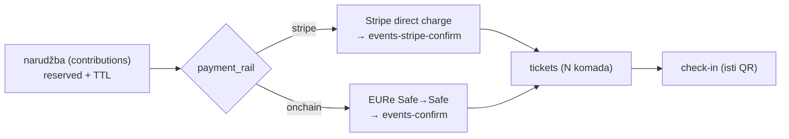

# U6 — airKUNA rail (plaćanje iz walleta uz karticu)

> Handoff prompt za praznu Claude Code sesiju. Repoi: `domovina-ulaznice` +
> `safe-wallet-monorepo` (grana `custom`). Ovisi o [U2](u2-javna-prodaja-web.md).
> **Ovo je zadnja faza i namjerno je odgođena** — airKUNA roadmap stavlja Događaje
> (R4) u ožujak–travanj 2027.
>
> _EN abstract: expose the already-working onchain rail as a second payment option
> on the same public event page — "pay by card" (Stripe) or "pay from wallet" (EURe
> on Gnosis, zero fees). Both produce identical tickets and check-in, because both
> confirm the same order in `pinka_finance`._

## Cilj

Na istoj stranici događaja posjetitelj bira karticu ili wallet. Organizator ne radi
ništa dodatno osim što upiše svoju Safe adresu. Ulaznica, QR i check-in su identični.

## Zašto je ovo jeftino

Onchain put **već postoji i deployan je** (E1–E4, 2026-07-17):
`events-confirm` verificira EURe transfer na Gnosisu i zove `confirm_ticket_order`,
koji izdaje iste ulaznice koje U1 izdaje preko `confirm_ticket_order_offchain`.
Dvije staze, jedna narudžba, jedan `tickets` red po komadu.



## Kontekst i izvori

- `safe-wallet-monorepo/docs/whitelabel-wallet/11-dogadjaji-p2p-ticketing.md` §3.3
  (tok kupnje), §4 (odluke), §8 (otvoreno: reconciliation bez klijentovog confirma).
- `.../15-airkuna-wallet.md`, `.../17-airkuna-roadmap.md` (R4 — Događaji).
- `.../handoffs/dogadjaji-1-event-pack.md` — mobilni feature-pack `events`.
- `domovina-api/supabase/functions/events-confirm/index.ts` — verifikacija receipta.
- **Dug iz doc 13 §6.1:** tx-hash šav prema Send flowu nikad nije dovršen
  (`recordTicketPayment` postoji, šav nedostaje) — ovdje se zatvara.

## Preduvjeti

| Preduvjet                                                     | Status |
| -------------------------------------------------------------- | ------ |
| Organizator ima Safe i upisao adresu (`destination_address`)   | ⬜     |
| Odluka o off-rampu EURe→IBAN (Monerium KYB) za organizatora    | ⬜     |
| airKUNA build s `features.events` na uređajima                 | ⬜     |

## Opseg

**IN:**

1. Na javnoj stranici (U2): drugi CTA "Plati iz airKUNA novčanika" — vidljiv samo
   ako događaj ima `destination_address`.
2. Web → app: deep link / universal link s `order_id` (ovo je "web prodajna stranica
   s universal linkom" koja je u doc 11 §8 svjesno izuzeta iz E4 — sad dolazi).
3. U appu: preuzmi narudžbu, plati postojećim Send flowom (EIP-681 prefill,
   risk-check se **nikad** ne zaobilazi), javi tx hash → `events-confirm`.
4. Fallback za kupca bez appa: prikaz iznosa i adrese + ručni unos tx hasha.
5. Nespareno plaćanje: postojeći red za ručno sparivanje (doc 11 §8) + prikaz
   stanja kupcu.
6. U dashboardu (U3): prihod po railu (kartica vs EURe), s naznakom da EURe sjeda
   trenutno, a Stripe po payout rasporedu.

**OUT:** NFT/attestation ulaznice (Tier 2+ iz receipts plana), preprodaja, cashless
na lokaciji, konverzija bilo koje vrste na platformi.

## Sigurnost (crvene linije, nepregovorljivo)

1. **Platforma ne drži sredstva, ne radi escrow, ne splita provizije, ne konvertira.**
   Svaka ideja koja to mijenja ide prvo na MiCA/CASP provjeru (doc 11 §6.2).
2. Onchain verifikacija JE autorizacija — klijentu se ne vjeruje ništa; idempotencija
   po `(tx_hash, log_index)`.
3. Skener ulaza nikad ne dijeli kod s payment skenerom.

## Kriteriji prihvaćanja

```
1. Isti događaj: kupnja karticom i kupnja iz walleta → identična ulaznica i QR
2. Check-in ne razlikuje rail
3. Dashboard prikazuje oba raila odvojeno i zbirno
4. Događaj bez Safe adrese → wallet CTA se ne prikazuje (bez izmišljenih adresa)
5. Postojeći Stripe tok nepromijenjen
```

## Zapisnik izvršenja

- Status: ⬜
- Commitovi (oba repoa):
- Odluke:
- Gotchai:
